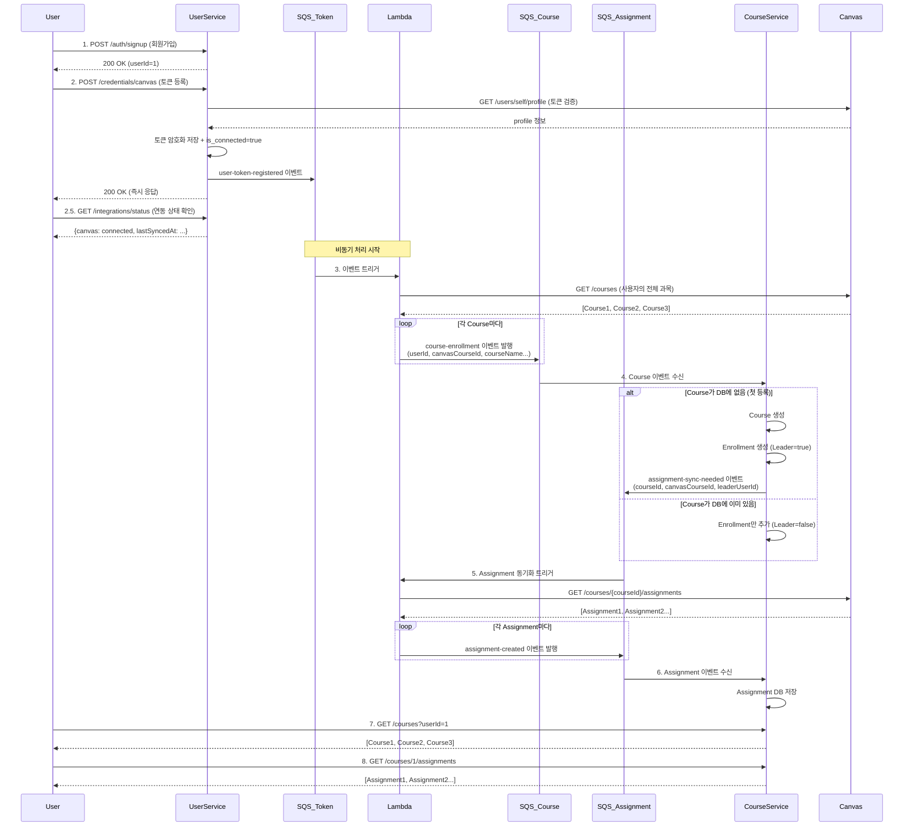

# E2E 자동 동기화 플로우 구현 가이드

## 🎯 목표
**사용자가 Canvas 토큰만 등록하면, 자동으로 Course 및 Assignment가 동기화되고, 조회 API로 확인 가능한 완전 자동화된 시스템**

---

## 📋 전체 플로우



---

## 📊 데이터 모델 (핵심 테이블)

### User-Service: `users`, `credentials`
```sql
-- users: 이미 구현됨 (Cognito 연동)

-- credentials: 연동 상태 필드 추가 필요
CREATE TABLE credentials (
    id BIGINT PRIMARY KEY AUTO_INCREMENT,
    user_id BIGINT NOT NULL,
    provider ENUM('CANVAS', 'GOOGLE_CALENDAR', 'OUTLOOK') NOT NULL,
    encrypted_token TEXT NOT NULL,
    is_connected BOOLEAN DEFAULT FALSE,  -- ✅ 추가: 연동 상태
    external_user_id VARCHAR(255),       -- ✅ 추가: Canvas/Google의 사용자 ID
    external_username VARCHAR(255),      -- ✅ 추가: Canvas/Google의 사용자명
    last_validated_at DATETIME,
    last_synced_at DATETIME,             -- ✅ 추가: 마지막 동기화 시간
    created_at DATETIME DEFAULT CURRENT_TIMESTAMP,
    updated_at DATETIME DEFAULT CURRENT_TIMESTAMP ON UPDATE CURRENT_TIMESTAMP,
    UNIQUE(user_id, provider)
);
```

### Course-Service: `courses`, `enrollments`, `assignments`
```sql
-- courses: 과목 정보
CREATE TABLE courses (
    id BIGINT PRIMARY KEY AUTO_INCREMENT,
    canvas_course_id BIGINT UNIQUE NOT NULL,
    name VARCHAR(255) NOT NULL,
    course_code VARCHAR(100),
    description TEXT,
    start_at DATETIME,
    end_at DATETIME,
    created_at DATETIME DEFAULT CURRENT_TIMESTAMP,
    updated_at DATETIME DEFAULT CURRENT_TIMESTAMP ON UPDATE CURRENT_TIMESTAMP
);

-- enrollments: 사용자-과목 수강 관계 (다대다) + Leader 플래그
CREATE TABLE enrollments (
    id BIGINT PRIMARY KEY AUTO_INCREMENT,
    user_id BIGINT NOT NULL,
    course_id BIGINT NOT NULL,
    is_sync_leader BOOLEAN DEFAULT FALSE,  -- 이 과목을 처음 등록한 사람
    enrolled_at DATETIME DEFAULT CURRENT_TIMESTAMP,
    UNIQUE(user_id, course_id),
    FOREIGN KEY (course_id) REFERENCES courses(id) ON DELETE CASCADE
);

-- assignments: 과제 정보 (이미 구현됨)
CREATE TABLE assignments (
    id BIGINT PRIMARY KEY AUTO_INCREMENT,
    canvas_assignment_id BIGINT UNIQUE NOT NULL,
    course_id BIGINT NOT NULL,
    title VARCHAR(255) NOT NULL,
    description TEXT,
    due_at DATETIME,
    points_possible INT,
    submission_types VARCHAR(255),
    created_at DATETIME DEFAULT CURRENT_TIMESTAMP,
    updated_at DATETIME DEFAULT CURRENT_TIMESTAMP ON UPDATE CURRENT_TIMESTAMP,
    FOREIGN KEY (course_id) REFERENCES courses(id) ON DELETE CASCADE
);
```

---

## 🔧 구현 작업 목록

### 1️⃣ User-Service: SQS 이벤트 발행

**파일**: `app/backend/user-service/src/main/java/com/unisync/user/credentials/service/CredentialsService.java`

**현재 상태**: 토큰만 저장하고 끝남 (Line 63-64 TODO 주석)

**필요한 작업**:
- [ ] SQS Publisher Bean 추가
- [ ] `registerCanvasToken()` 메서드에 이벤트 발행 로직 추가

**구현 코드**:
```java
@Service
@RequiredArgsConstructor
public class CredentialsService {

    private final SqsTemplate sqsTemplate;

    @Transactional
    public RegisterCanvasTokenResponse registerCanvasToken(Long userId, RegisterCanvasTokenRequest request) {
        // 1. 토큰 유효성 검증
        canvasApiClient.validateToken(request.getCanvasToken());

        // 2. 암호화 저장
        String encryptedToken = encryptionService.encrypt(request.getCanvasToken());
        Credentials credentials = ...;
        credentialsRepository.save(credentials);

        // 3. SQS 이벤트 발행 ✅ 추가
        UserTokenRegisteredEvent event = UserTokenRegisteredEvent.builder()
            .userId(userId)
            .provider("CANVAS")
            .registeredAt(LocalDateTime.now())
            .build();

        sqsTemplate.send("user-token-registered-queue", event);
        log.info("Published user-token-registered event for userId={}", userId);

        return RegisterCanvasTokenResponse.builder()
            .success(true)
            .message("Canvas token registered successfully")
            .build();
    }
}
```

**필요한 DTO**:
```java
// app/shared/java-common/src/main/java/com/unisync/shared/dto/sqs/UserTokenRegisteredEvent.java
@Data
@Builder
public class UserTokenRegisteredEvent {
    private Long userId;
    private String provider; // "CANVAS"
    private LocalDateTime registeredAt;
}
```

---

### 2️⃣ SQS 큐 생성

**파일**: `localstack-init/01-create-queues.sh`

**추가할 큐**:
```bash
# user-token-registered-queue: Canvas 토큰 등록 이벤트
awslocal sqs create-queue \
  --queue-name user-token-registered-queue \
  --region $REGION \
  --attributes VisibilityTimeout=30,MessageRetentionPeriod=345600

# course-enrollment-queue: Course 등록 이벤트 (사용자별)
awslocal sqs create-queue \
  --queue-name course-enrollment-queue \
  --region $REGION \
  --attributes VisibilityTimeout=30,MessageRetentionPeriod=345600

# assignment-sync-needed-queue: 새 Course의 Assignment 동기화 트리거
awslocal sqs create-queue \
  --queue-name assignment-sync-needed-queue \
  --region $REGION \
  --attributes VisibilityTimeout=60,MessageRetentionPeriod=345600

echo "SQS 큐 생성 완료"
```

---

### 3️⃣ Lambda: Course 목록 동기화 기능

**파일**: `app/serverless/canvas-sync-lambda/src/handler.py`

**새 핸들러 추가**: `initial_sync_handler()`

```python
def initial_sync_handler(event, context):
    """
    사용자의 Canvas 토큰 등록 시 최초 동기화

    Input (from user-token-registered-queue):
        {
            "userId": 1,
            "provider": "CANVAS",
            "registeredAt": "2025-11-05T12:00:00Z"
        }

    Output:
        - course-enrollment-queue에 사용자의 전체 Course 발행
    """
    user_id = event['userId']

    print(f"🚀 Initial sync started for userId={user_id}")

    # 1. User-Service에서 Canvas 토큰 조회
    canvas_token = get_canvas_token(user_id)

    # 2. Canvas API: 사용자의 전체 Course 조회
    courses = fetch_user_courses(canvas_token)
    print(f"  - Fetched {len(courses)} courses")

    # 3. 각 Course마다 SQS 이벤트 발행
    for course in courses:
        send_to_sqs('course-enrollment-queue', {
            'eventType': 'COURSE_ENROLLMENT',
            'userId': user_id,
            'canvasCourseId': course['id'],
            'name': course['name'],
            'courseCode': course['course_code'],
            'startAt': course.get('start_at'),
            'endAt': course.get('end_at')
        })

    print(f"✅ Initial sync completed: {len(courses)} courses published")

    return {
        'statusCode': 200,
        'body': {'coursesCount': len(courses)}
    }


def fetch_user_courses(token: str) -> List[Dict[str, Any]]:
    """사용자가 수강 중인 Course 목록 가져오기"""
    url = f"{CANVAS_API_BASE_URL}/courses"
    headers = {'Authorization': f'Bearer {token}'}
    params = {
        'enrollment_type': 'student',
        'enrollment_state': 'active',
        'include[]': ['term', 'course_progress']
    }

    response = requests.get(url, headers=headers, params=params, timeout=10)
    response.raise_for_status()

    return response.json()
```

**LocalStack Lambda 배포 수정** (`localstack-init/03-deploy-lambdas.sh`):
```bash
# canvas-sync-lambda에 SQS 트리거 연결
echo "📌 Setting up Lambda triggers..."

# initial_sync_handler → user-token-registered-queue
awslocal lambda create-event-source-mapping \
  --function-name canvas-sync-lambda \
  --event-source-arn arn:aws:sqs:us-east-1:000000000000:user-token-registered-queue \
  --batch-size 1 \
  --enabled

# assignment_sync_handler → assignment-sync-needed-queue
awslocal lambda create-event-source-mapping \
  --function-name canvas-sync-lambda \
  --event-source-arn arn:aws:sqs:us-east-1:000000000000:assignment-sync-needed-queue \
  --batch-size 1 \
  --enabled

echo "✅ Lambda triggers configured"
```

---

### 4️⃣ Course-Service: Enrollment 엔티티 추가

**새 파일**: `app/backend/course-service/src/main/java/com/unisync/course/common/entity/Enrollment.java`

```java
@Entity
@Table(name = "enrollments", uniqueConstraints = {
    @UniqueConstraint(columnNames = {"user_id", "course_id"})
})
@Getter
@Builder
@NoArgsConstructor
@AllArgsConstructor
public class Enrollment {

    @Id
    @GeneratedValue(strategy = GenerationType.IDENTITY)
    private Long id;

    @Column(name = "user_id", nullable = false)
    private Long userId;

    @ManyToOne(fetch = FetchType.LAZY)
    @JoinColumn(name = "course_id", nullable = false)
    private Course course;

    @Column(name = "is_sync_leader", nullable = false)
    private Boolean isSyncLeader = false;

    @Column(name = "enrolled_at", nullable = false)
    private LocalDateTime enrolledAt;
}
```

**Repository**:
```java
public interface EnrollmentRepository extends JpaRepository<Enrollment, Long> {
    Optional<Enrollment> findByUserIdAndCourseId(Long userId, Long courseId);
    List<Enrollment> findAllByUserId(Long userId);
    List<Enrollment> findAllByCourseId(Long courseId);
    boolean existsByCourseId(Long courseId); // Course에 수강생이 있는지
}
```

---

### 5️⃣ Course-Service: Course SQS 리스너

**새 파일**: `app/backend/course-service/src/main/java/com/unisync/course/course/listener/CourseEnrollmentListener.java`

```java
@Slf4j
@Component
@RequiredArgsConstructor
public class CourseEnrollmentListener {

    private final CourseService courseService;
    private final EnrollmentRepository enrollmentRepository;
    private final CourseRepository courseRepository;
    private final SqsTemplate sqsTemplate;
    private final ObjectMapper objectMapper;

    @SqsListener(value = "course-enrollment-queue")
    public void handleCourseEnrollment(@Payload String message) {
        try {
            log.info("Received course-enrollment event: {}", message);

            CourseEnrollmentEvent event = objectMapper.readValue(message, CourseEnrollmentEvent.class);

            // 1. Course가 DB에 있는지 확인
            Optional<Course> existingCourse = courseRepository
                .findByCanvasCourseId(event.getCanvasCourseId());

            Course course;
            boolean isNewCourse = false;

            if (existingCourse.isEmpty()) {
                // 2-a. Course 없음 → 생성
                course = Course.builder()
                    .canvasCourseId(event.getCanvasCourseId())
                    .name(event.getName())
                    .courseCode(event.getCourseCode())
                    .startAt(event.getStartAt())
                    .endAt(event.getEndAt())
                    .build();

                course = courseRepository.save(course);
                isNewCourse = true;

                log.info("Created new course: canvasCourseId={}, name={}",
                    event.getCanvasCourseId(), event.getName());
            } else {
                // 2-b. Course 있음 → 기존 사용
                course = existingCourse.get();
                log.info("Course already exists: id={}", course.getId());
            }

            // 3. Enrollment 생성 (중복 체크)
            if (!enrollmentRepository.existsByUserIdAndCourseId(event.getUserId(), course.getId())) {
                Enrollment enrollment = Enrollment.builder()
                    .userId(event.getUserId())
                    .course(course)
                    .isSyncLeader(isNewCourse) // 첫 등록자가 Leader
                    .enrolledAt(LocalDateTime.now())
                    .build();

                enrollmentRepository.save(enrollment);

                log.info("Created enrollment: userId={}, courseId={}, leader={}",
                    event.getUserId(), course.getId(), isNewCourse);
            }

            // 4. 새 Course면 Assignment 동기화 필요
            if (isNewCourse) {
                AssignmentSyncNeededEvent syncEvent = AssignmentSyncNeededEvent.builder()
                    .courseId(course.getId())
                    .canvasCourseId(course.getCanvasCourseId())
                    .leaderUserId(event.getUserId())
                    .build();

                sqsTemplate.send("assignment-sync-needed-queue", syncEvent);

                log.info("Published assignment-sync-needed event for courseId={}", course.getId());
            }

        } catch (Exception e) {
            log.error("Failed to process course-enrollment event", e);
            throw new RuntimeException("Course enrollment processing failed", e);
        }
    }
}
```

**필요한 DTO**:
```java
// app/shared/java-common/src/main/java/com/unisync/shared/dto/sqs/CourseEnrollmentEvent.java
@Data
@Builder
@JsonIgnoreProperties(ignoreUnknown = true)
public class CourseEnrollmentEvent {
    private String eventType; // "COURSE_ENROLLMENT"
    private Long userId;
    private Long canvasCourseId;
    private String name;
    private String courseCode;
    private LocalDateTime startAt;
    private LocalDateTime endAt;
}

// app/shared/java-common/src/main/java/com/unisync/shared/dto/sqs/AssignmentSyncNeededEvent.java
@Data
@Builder
public class AssignmentSyncNeededEvent {
    private Long courseId;         // UniSync DB의 Course ID
    private Long canvasCourseId;   // Canvas의 Course ID
    private Long leaderUserId;     // Leader의 토큰으로 조회
}
```

---

### 6️⃣ Lambda: Assignment 동기화 핸들러

**파일**: `app/serverless/canvas-sync-lambda/src/handler.py`

```python
def assignment_sync_handler(event, context):
    """
    새 Course가 등록되었을 때 Assignment 동기화

    Input (from assignment-sync-needed-queue):
        {
            "courseId": 1,
            "canvasCourseId": 789,
            "leaderUserId": 1
        }
    """
    course_id = event['courseId']
    canvas_course_id = event['canvasCourseId']
    leader_user_id = event['leaderUserId']

    print(f"🔄 Assignment sync for courseId={course_id}, canvasCourseId={canvas_course_id}")

    # 1. Leader의 Canvas 토큰 조회
    canvas_token = get_canvas_token(leader_user_id)

    # 2. Canvas API: Assignment 목록 조회
    assignments = fetch_canvas_assignments(canvas_token, canvas_course_id)
    print(f"  - Fetched {len(assignments)} assignments")

    # 3. SQS에 Assignment 이벤트 발행
    for assignment in assignments:
        send_to_sqs('assignment-events-queue', {
            'eventType': 'ASSIGNMENT_CREATED',
            'canvasAssignmentId': assignment['id'],
            'canvasCourseId': canvas_course_id,
            'title': assignment['name'],
            'description': assignment.get('description', ''),
            'dueAt': assignment.get('due_at'),
            'pointsPossible': assignment.get('points_possible'),
            'submissionTypes': ','.join(assignment.get('submission_types', []))
        })

    print(f"✅ Assignment sync completed: {len(assignments)} published")

    return {'statusCode': 200, 'body': {'assignmentsCount': len(assignments)}}
```

**handler.py 라우팅 로직 추가**:
```python
def lambda_handler(event, context):
    """
    통합 라우터:
    - SQS event source에서 queueName 확인하여 적절한 핸들러 호출
    """
    # SQS 이벤트인 경우
    if 'Records' in event:
        for record in event['Records']:
            queue_name = record['eventSourceARN'].split(':')[-1]
            message_body = json.loads(record['body'])

            if queue_name == 'user-token-registered-queue':
                return initial_sync_handler(message_body, context)
            elif queue_name == 'assignment-sync-needed-queue':
                return assignment_sync_handler(message_body, context)

    # Step Functions에서 직접 호출 (기존 로직)
    return periodic_sync_handler(event, context)
```

---

### 7️⃣ Course-Service: Course 조회 API

**새 파일**: `app/backend/course-service/src/main/java/com/unisync/course/course/controller/CourseController.java`

```java
@RestController
@RequestMapping("/api/v1/courses")
@RequiredArgsConstructor
public class CourseController {

    private final CourseQueryService courseQueryService;

    @GetMapping
    public ResponseEntity<List<CourseResponse>> getUserCourses(
        @RequestParam Long userId
    ) {
        List<CourseResponse> courses = courseQueryService.getUserCourses(userId);
        return ResponseEntity.ok(courses);
    }

    @GetMapping("/{courseId}")
    public ResponseEntity<CourseResponse> getCourse(
        @PathVariable Long courseId
    ) {
        return courseQueryService.getCourse(courseId)
            .map(ResponseEntity::ok)
            .orElse(ResponseEntity.notFound().build());
    }

    @GetMapping("/{courseId}/assignments")
    public ResponseEntity<List<AssignmentResponse>> getCourseAssignments(
        @PathVariable Long courseId
    ) {
        List<AssignmentResponse> assignments = courseQueryService.getCourseAssignments(courseId);
        return ResponseEntity.ok(assignments);
    }
}
```

**Service**:
```java
@Service
@RequiredArgsConstructor
public class CourseQueryService {

    private final EnrollmentRepository enrollmentRepository;
    private final CourseRepository courseRepository;
    private final AssignmentRepository assignmentRepository;

    public List<CourseResponse> getUserCourses(Long userId) {
        List<Enrollment> enrollments = enrollmentRepository.findAllByUserId(userId);

        return enrollments.stream()
            .map(enrollment -> CourseResponse.from(enrollment.getCourse()))
            .collect(Collectors.toList());
    }

    public Optional<CourseResponse> getCourse(Long courseId) {
        return courseRepository.findById(courseId)
            .map(CourseResponse::from);
    }

    public List<AssignmentResponse> getCourseAssignments(Long courseId) {
        List<Assignment> assignments = assignmentRepository.findAllByCourseId(courseId);

        return assignments.stream()
            .map(AssignmentResponse::from)
            .collect(Collectors.toList());
    }
}
```

**DTO**:
```java
@Data
@Builder
public class CourseResponse {
    private Long id;
    private Long canvasCourseId;
    private String name;
    private String courseCode;
    private LocalDateTime startAt;
    private LocalDateTime endAt;

    public static CourseResponse from(Course course) {
        return CourseResponse.builder()
            .id(course.getId())
            .canvasCourseId(course.getCanvasCourseId())
            .name(course.getName())
            .courseCode(course.getCourseCode())
            .startAt(course.getStartAt())
            .endAt(course.getEndAt())
            .build();
    }
}
```

---

### 8️⃣ E2E 테스트: 완전 자동화

**파일**: `tests/integration/test_user_canvas_sync_e2e.py` (신규 생성)

```python
"""
완전 자동화 E2E 테스트
사용자 회원가입 → Canvas 토큰 등록 → 자동 동기화 → 조회 검증
"""

import pytest
import json
import time
import requests
import os
from datetime import datetime


class TestUserCanvasSyncE2E:
    """완전 자동화된 사용자 Canvas 동기화 E2E 테스트"""

    @pytest.mark.usefixtures("wait_for_services", "clean_database", "clean_sqs_queue")
    def test_full_user_journey_from_signup_to_data_sync(
        self, mysql_connection
    ):
        """
        완전 자동화 시나리오:
        1. 회원가입 (User-Service)
        2. Canvas 토큰 등록 (User-Service)
        3. 자동으로 Lambda → Course-Service 동기화
        4. Course 조회 검증
        5. Assignment 조회 검증
        """
        # Given: 테스트용 사용자 ID
        test_user_id = 1
        canvas_token = os.getenv("CANVAS_API_TOKEN")

        if not canvas_token:
            pytest.skip("CANVAS_API_TOKEN not set in .env")

        print("\n" + "="*60)
        print("🚀 E2E Test: Full User Canvas Sync Journey")
        print("="*60)

        # Step 1: 회원가입 (실제로는 Cognito이므로 생략, DB에 User 직접 삽입)
        print("\n[1/5] 회원가입...")
        cursor = mysql_connection.cursor()
        # User-Service DB에 사용자 추가 (실제로는 Cognito 연동)
        # 여기서는 user_id=1이 이미 있다고 가정
        print("  ✅ userId=1 (테스트용)")

        # Step 2: Canvas 토큰 등록
        print("\n[2/6] Canvas 토큰 등록...")
        response = requests.post(
            "http://localhost:8081/api/v1/credentials/canvas",
            headers={"X-User-Id": str(test_user_id)},
            json={"canvasToken": canvas_token},
            timeout=5
        )

        assert response.status_code == 200, f"토큰 등록 실패: {response.text}"
        print(f"  ✅ Canvas 토큰 등록 완료 (즉시 응답)")

        # Step 2.5: 연동 상태 확인
        print("\n[2.5/6] 연동 상태 확인...")
        status_response = requests.get(
            "http://localhost:8081/api/v1/integrations/status",
            headers={"X-User-Id": str(test_user_id)},
            timeout=5
        )

        assert status_response.status_code == 200, f"연동 상태 조회 실패: {status_response.text}"
        status = status_response.json()
        assert status.get('canvas') is not None, "Canvas 연동 정보가 없음"
        assert status['canvas']['isConnected'] == True, "Canvas 연동 상태가 false"
        print(f"  ✅ Canvas 연동 확인: {status['canvas']['externalUsername']}")

        # Step 3: 백그라운드 동기화 대기
        print("\n[3/5] 자동 동기화 대기 중...")
        print("  (user-token-registered → Lambda → course-enrollment → Course-Service)")
        print("  (assignment-sync-needed → Lambda → assignment-events → Course-Service)")

        # Course가 생성될 때까지 폴링 (최대 30초)
        max_wait = 30
        courses = []

        for i in range(max_wait):
            try:
                # Course-Service DB 직접 확인
                cursor = mysql_connection.cursor(dictionary=True)
                cursor.execute("""
                    SELECT c.*
                    FROM courses c
                    JOIN enrollments e ON c.id = e.course_id
                    WHERE e.user_id = %s
                """, (test_user_id,))
                courses = cursor.fetchall()
                cursor.close()

                if len(courses) > 0:
                    print(f"  ✅ {len(courses)} courses 동기화 완료 ({i+1}초 소요)")
                    break
            except Exception as e:
                pass

            time.sleep(1)

        assert len(courses) > 0, "❌ Course 동기화 실패 (30초 타임아웃)"

        # Step 4: Course 조회 API 검증
        print("\n[4/5] Course 조회 API 검증...")
        courses_response = requests.get(
            f"http://localhost:8082/api/v1/courses?userId={test_user_id}",
            timeout=5
        )

        assert courses_response.status_code == 200, f"Course 조회 실패: {courses_response.text}"
        courses_from_api = courses_response.json()
        assert len(courses_from_api) > 0, "조회된 Course가 없음"

        print(f"  ✅ {len(courses_from_api)} courses 조회됨")
        for course in courses_from_api[:3]:  # 처음 3개만 출력
            print(f"     - {course['name']} ({course['courseCode']})")

        # Step 5: Assignment 조회 API 검증
        print("\n[5/5] Assignment 조회 API 검증...")
        first_course_id = courses_from_api[0]['id']

        # Assignment가 생성될 때까지 폴링 (최대 20초)
        assignments = []
        for i in range(20):
            assignments_response = requests.get(
                f"http://localhost:8082/api/v1/courses/{first_course_id}/assignments",
                timeout=5
            )

            if assignments_response.status_code == 200:
                assignments = assignments_response.json()
                if len(assignments) > 0:
                    print(f"  ✅ {len(assignments)} assignments 동기화 완료 ({i+1}초 소요)")
                    break

            time.sleep(1)

        assert len(assignments) > 0, f"Assignment 동기화 실패 (Course: {courses_from_api[0]['name']})"

        for assignment in assignments[:3]:  # 처음 3개만 출력
            print(f"     - {assignment['title']} (due: {assignment.get('dueAt', 'N/A')})")

        # Final Summary
        print("\n" + "="*60)
        print("✅ E2E 테스트 성공!")
        print(f"   - 사용자 ID: {test_user_id}")
        print(f"   - Courses: {len(courses_from_api)}개")
        print(f"   - Assignments: {len(assignments)}개 (첫 번째 과목)")
        print("="*60 + "\n")
```

**conftest.py에 추가할 Fixture**:
```python
@pytest.fixture(scope="function")
def clean_database(mysql_connection):
    """각 테스트 전후 course_db와 user_db 정리"""
    cursor = mysql_connection.cursor()

    # 테스트 전: 정리
    cursor.execute("SET FOREIGN_KEY_CHECKS = 0")
    cursor.execute("TRUNCATE TABLE assignments")
    cursor.execute("TRUNCATE TABLE enrollments")
    cursor.execute("TRUNCATE TABLE courses")
    cursor.execute("SET FOREIGN_KEY_CHECKS = 1")
    mysql_connection.commit()

    yield

    # 테스트 후: 정리
    cursor.execute("SET FOREIGN_KEY_CHECKS = 0")
    cursor.execute("TRUNCATE TABLE assignments")
    cursor.execute("TRUNCATE TABLE enrollments")
    cursor.execute("TRUNCATE TABLE courses")
    cursor.execute("SET FOREIGN_KEY_CHECKS = 1")
    mysql_connection.commit()
    cursor.close()
```

---

## 🔄 전체 데이터 흐름 요약

### 사용자 관점
```
1. 회원가입
2. Canvas 토큰 입력
3. (자동) 강의 목록 동기화 완료
4. 앱에서 강의 & 과제 확인
```

### 시스템 내부
```
1. POST /credentials/canvas
   → user-token-registered-queue

2. Lambda (initial_sync_handler)
   → Canvas API: GET /courses
   → course-enrollment-queue (여러 개)

3. Course-Service (CourseEnrollmentListener)
   → Course 생성 (없으면) + Enrollment 생성
   → 새 Course면: assignment-sync-needed-queue

4. Lambda (assignment_sync_handler)
   → Canvas API: GET /courses/{id}/assignments
   → assignment-events-queue (여러 개)

5. Course-Service (AssignmentEventListener)
   → Assignment DB 저장

6. GET /courses?userId=1
   → Course 목록 반환

7. GET /courses/{id}/assignments
   → Assignment 목록 반환
```

---

### 9️⃣ User-Service: 연동 상태 확인 API ✨

**목적**: 사용자가 Canvas/Google Calendar 연동 상태를 확인할 수 있는 API

#### Credentials 엔티티 수정

**파일**: `app/backend/user-service/src/main/java/com/unisync/user/common/entity/Credentials.java`

```java
@Entity
@Table(name = "credentials")
@Getter
@Setter  // is_connected 업데이트를 위해 Setter 필요
@Builder
@NoArgsConstructor
@AllArgsConstructor
public class Credentials {

    @Id
    @GeneratedValue(strategy = GenerationType.IDENTITY)
    private Long id;

    @Column(name = "user_id", nullable = false)
    private Long userId;

    @Enumerated(EnumType.STRING)
    @Column(name = "provider", nullable = false)
    private CredentialProvider provider;

    @Column(name = "encrypted_token", nullable = false, columnDefinition = "TEXT")
    private String encryptedToken;

    // ✅ 추가 필드
    @Column(name = "is_connected", nullable = false)
    private Boolean isConnected = false;

    @Column(name = "external_user_id")
    private String externalUserId;  // Canvas user ID

    @Column(name = "external_username")
    private String externalUsername;  // Canvas username

    @Column(name = "last_validated_at")
    private LocalDateTime lastValidatedAt;

    @Column(name = "last_synced_at")
    private LocalDateTime lastSyncedAt;

    @Column(name = "created_at", nullable = false, updatable = false)
    private LocalDateTime createdAt;

    @Column(name = "updated_at", nullable = false)
    private LocalDateTime updatedAt;

    @PrePersist
    protected void onCreate() {
        createdAt = LocalDateTime.now();
        updatedAt = LocalDateTime.now();
    }

    @PreUpdate
    protected void onUpdate() {
        updatedAt = LocalDateTime.now();
    }
}
```

#### CanvasApiClient 수정 (Profile 조회 추가)

**파일**: `app/backend/user-service/src/main/java/com/unisync/user/credentials/service/CanvasApiClient.java`

```java
@Component
@RequiredArgsConstructor
public class CanvasApiClient {

    private final RestTemplate restTemplate;

    @Value("${canvas.api.base-url}")
    private String canvasApiBaseUrl;

    /**
     * Canvas 토큰 유효성 검증 + 사용자 정보 조회
     */
    public CanvasProfile validateTokenAndGetProfile(String token) {
        String url = canvasApiBaseUrl + "/users/self/profile";

        HttpHeaders headers = new HttpHeaders();
        headers.set("Authorization", "Bearer " + token);
        HttpEntity<String> entity = new HttpEntity<>(headers);

        try {
            ResponseEntity<CanvasProfile> response = restTemplate.exchange(
                url,
                HttpMethod.GET,
                entity,
                CanvasProfile.class
            );

            if (response.getStatusCode() == HttpStatus.OK && response.getBody() != null) {
                return response.getBody();
            }

            throw new InvalidCanvasTokenException("Canvas API returned empty profile");

        } catch (HttpClientErrorException e) {
            throw new InvalidCanvasTokenException("Invalid Canvas token: " + e.getMessage());
        }
    }

    @Data
    public static class CanvasProfile {
        private Long id;
        private String name;
        private String login_id;  // Canvas username
        private String primary_email;
    }
}
```

#### CredentialsService 수정

```java
@Transactional
public RegisterCanvasTokenResponse registerCanvasToken(Long userId, RegisterCanvasTokenRequest request) {
    log.info("Registering Canvas token for user: {}", userId);

    // 1. Canvas API로 토큰 유효성 검증 + 프로필 조회
    CanvasApiClient.CanvasProfile profile = canvasApiClient
        .validateTokenAndGetProfile(request.getCanvasToken());

    // 2. 암호화
    String encryptedToken = encryptionService.encrypt(request.getCanvasToken());

    // 3. DB 저장 (이미 있으면 업데이트)
    Credentials credentials = credentialsRepository
        .findByUserIdAndProvider(userId, CredentialProvider.CANVAS)
        .orElse(Credentials.builder()
            .userId(userId)
            .provider(CredentialProvider.CANVAS)
            .build());

    credentials.setEncryptedToken(encryptedToken);
    credentials.setIsConnected(true);  // ✅ 연동 상태 true
    credentials.setExternalUserId(String.valueOf(profile.getId()));
    credentials.setExternalUsername(profile.getLogin_id());
    credentials.setLastValidatedAt(LocalDateTime.now());

    credentialsRepository.save(credentials);

    // 4. SQS 이벤트 발행
    sqsTemplate.send("user-token-registered-queue", UserTokenRegisteredEvent.builder()
        .userId(userId)
        .provider("CANVAS")
        .registeredAt(LocalDateTime.now())
        .build());

    log.info("Canvas token registered for userId={}, externalUserId={}",
        userId, profile.getId());

    return RegisterCanvasTokenResponse.builder()
        .success(true)
        .message("Canvas token registered successfully")
        .build();
}
```

#### 연동 상태 API 추가

**새 파일**: `app/backend/user-service/src/main/java/com/unisync/user/integration/controller/IntegrationStatusController.java`

```java
@RestController
@RequestMapping("/api/v1/integrations")
@RequiredArgsConstructor
@Tag(name = "Integration Status", description = "외부 연동 상태 조회 API")
public class IntegrationStatusController {

    private final IntegrationStatusService integrationStatusService;

    @GetMapping("/status")
    @Operation(summary = "연동 상태 조회", description = "Canvas, Google Calendar 등의 연동 상태를 조회합니다.")
    public ResponseEntity<IntegrationStatusResponse> getIntegrationStatus(
        @RequestHeader(value = "X-User-Id") Long userId
    ) {
        IntegrationStatusResponse status = integrationStatusService.getIntegrationStatus(userId);
        return ResponseEntity.ok(status);
    }
}
```

**Service**:
```java
@Service
@RequiredArgsConstructor
public class IntegrationStatusService {

    private final CredentialsRepository credentialsRepository;

    public IntegrationStatusResponse getIntegrationStatus(Long userId) {
        List<Credentials> allCredentials = credentialsRepository.findAllByUserId(userId);

        IntegrationStatusResponse response = new IntegrationStatusResponse();

        for (Credentials cred : allCredentials) {
            IntegrationInfo info = IntegrationInfo.builder()
                .isConnected(cred.getIsConnected())
                .externalUsername(cred.getExternalUsername())
                .lastValidatedAt(cred.getLastValidatedAt())
                .lastSyncedAt(cred.getLastSyncedAt())
                .build();

            switch (cred.getProvider()) {
                case CANVAS:
                    response.setCanvas(info);
                    break;
                case GOOGLE_CALENDAR:
                    response.setGoogleCalendar(info);
                    break;
                case OUTLOOK:
                    response.setOutlook(info);
                    break;
            }
        }

        return response;
    }
}
```

**DTO**:
```java
@Data
@Builder
@NoArgsConstructor
@AllArgsConstructor
public class IntegrationStatusResponse {
    private IntegrationInfo canvas;
    private IntegrationInfo googleCalendar;
    private IntegrationInfo outlook;
}

@Data
@Builder
@NoArgsConstructor
@AllArgsConstructor
public class IntegrationInfo {
    private Boolean isConnected;
    private String externalUsername;
    private LocalDateTime lastValidatedAt;
    private LocalDateTime lastSyncedAt;
}
```

**Repository 메서드 추가**:
```java
public interface CredentialsRepository extends JpaRepository<Credentials, Long> {
    Optional<Credentials> findByUserIdAndProvider(Long userId, CredentialProvider provider);
    List<Credentials> findAllByUserId(Long userId);  // ✅ 추가
    boolean existsByUserIdAndProvider(Long userId, CredentialProvider provider);
    void deleteByUserIdAndProvider(Long userId, CredentialProvider provider);
}
```

---

## 📋 구현 체크리스트

- [x] 0️⃣ Credentials 테이블 스키마 업데이트
  - ✅ `is_connected`, `external_user_id`, `external_username`, `last_synced_at` 필드 추가됨
  - 📁 `Credentials.java` 완료

- [x] 1️⃣ User-Service: SQS 이벤트 발행
  - ✅ `SqsPublisher` 서비스 구현됨
  - ✅ `CredentialsService.publishUserTokenRegisteredEvent()` 구현됨
  - ✅ Canvas 프로필 조회 기능 추가 (`CanvasApiClient.validateTokenAndGetProfile()`)
  - 📁 `CredentialsService.java`, `SqsPublisher.java`, `CanvasApiClient.java` 완료

- [x] 2️⃣ SQS 큐 생성 (3개 추가)
  - ✅ `user-token-registered-queue`
  - ✅ `course-enrollment-queue`
  - ✅ `assignment-sync-needed-queue`
  - 📁 `01-create-queues.sh` 완료

- [x] 3️⃣ Lambda: `initial_sync_handler()` 구현
  - ✅ `initial_sync_handler()` 함수 구현됨
  - ✅ `fetch_user_courses()` 함수 구현됨
  - 📁 `handler.py` 일부 완료

- [ ] 4️⃣ Course-Service: Enrollment 엔티티 추가
- [ ] 5️⃣ Course-Service: Course SQS 리스너
- [ ] 6️⃣ Lambda: `assignment_sync_handler()` 구현
- [ ] 7️⃣ Course-Service: Course 조회 API
- [ ] 8️⃣ E2E 테스트 작성 및 검증
- [ ] 9️⃣ User-Service: 연동 상태 확인 API
- [ ] 🔟 pytest-html 추가 (테스트 리포트)
- [ ] 1️⃣1️⃣ 전체 시나리오 통과 확인

---

### 📊 진행률: 35% (4/11 완료)

**다음 단계**: 4️⃣ Course-Service Enrollment 엔티티 및 Repository 구현

---

## 🎯 성공 기준

**E2E 테스트가 다음을 검증:**
1. ✅ Canvas 토큰 등록 API 호출 성공
2. ✅ 빈 DB에서 시작해도 Course가 자동으로 채워짐
3. ✅ Assignment도 자동으로 채워짐
4. ✅ 조회 API로 데이터 확인 가능
5. ✅ Leader 플래그가 올바르게 설정됨 (첫 등록자)
6. ✅ 전체 과정이 30초 이내 완료

---

## 📌 핵심 설계 원칙

1. **이벤트 드리븐**: 모든 동기화는 SQS 이벤트 기반
2. **멱등성**: 동일 Course/Assignment 재등록 시 중복 생성 방지
3. **Leader 선출**: Course당 첫 등록자만 Canvas API 호출
4. **느슨한 결합**: User-Service는 Lambda를 모름, SQS만 알면 됨
5. **완전 자동화**: 사용자는 토큰만 등록, 나머지는 시스템이 처리