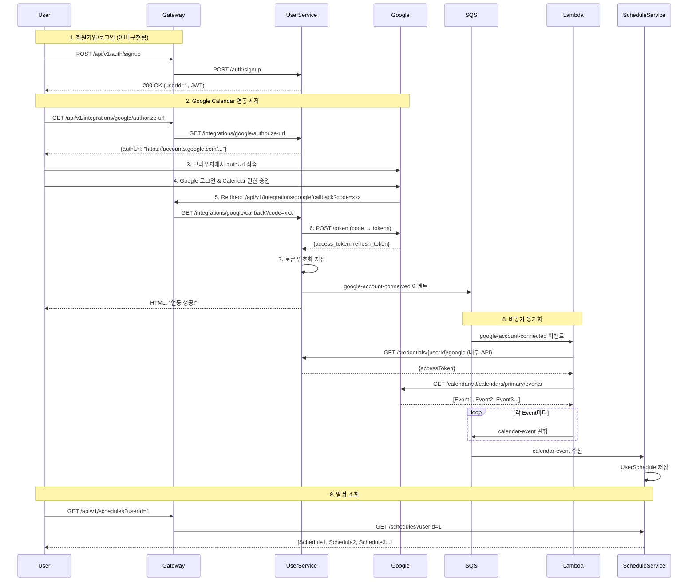

# Google Calendar 연동 구현 계획

## 🎯 목표
**사용자가 Google 계정을 연결하면, Google Calendar 일정이 자동으로 동기화되어 Schedule-Service에서 조회 가능한 시스템**

**방식**: Cognito 로그인 + 별도 Google OAuth2 (하이브리드)
- Cognito: 회원가입/로그인 인증 (이미 구현됨)
- Google OAuth2: Calendar API 접근 권한 획득 (신규 구현)

---

## 📋 전체 플로우 (프론트엔드 없이)



---

## 🔐 Google OAuth2 인증 플로우

### Authorization Code Grant Flow

1. **Authorization URL 생성**
   ```
   GET https://accounts.google.com/o/oauth2/v2/auth
   ?client_id={GOOGLE_CLIENT_ID}
   &redirect_uri=http://localhost:8080/api/v1/integrations/google/callback
   &response_type=code
   &scope=https://www.googleapis.com/auth/calendar.readonly
   &access_type=offline
   &prompt=consent
   ```

2. **사용자 동의 후 Callback**
   ```
   GET http://localhost:8080/api/v1/integrations/google/callback?code={AUTHORIZATION_CODE}
   ```

3. **Access Token 발급**
   ```
   POST https://oauth2.googleapis.com/token
   {
       "client_id": "{GOOGLE_CLIENT_ID}",
       "client_secret": "{GOOGLE_CLIENT_SECRET}",
       "code": "{AUTHORIZATION_CODE}",
       "grant_type": "authorization_code",
       "redirect_uri": "http://localhost:8080/api/v1/integrations/google/callback"
   }

   Response:
   {
       "access_token": "ya29.xxx",
       "refresh_token": "1//xxx",
       "expires_in": 3600,
       "scope": "https://www.googleapis.com/auth/calendar.readonly",
       "token_type": "Bearer"
   }
   ```

4. **Refresh Token으로 갱신** (Access Token 만료 시)
   ```
   POST https://oauth2.googleapis.com/token
   {
       "client_id": "{GOOGLE_CLIENT_ID}",
       "client_secret": "{GOOGLE_CLIENT_SECRET}",
       "refresh_token": "{REFRESH_TOKEN}",
       "grant_type": "refresh_token"
   }
   ```

---

## 🏗️ 아키텍처: Gateway 기반

### 요청 라우팅 구조

```
외부 요청 → Gateway (8080) → 내부 서비스 (StripPrefix)

예시:
1. GET http://localhost:8080/api/v1/integrations/google/authorize-url
   → Gateway: /api/v1 제거 (StripPrefix=2)
   → User-Service (8081): GET /integrations/google/authorize-url

2. GET http://localhost:8080/api/v1/schedules?userId=1
   → Gateway: /api/v1 제거
   → Schedule-Service (8083): GET /schedules?userId=1
```

### Google Redirect URI

```bash
# Google Cloud Console에 등록할 URI (반드시 Gateway 주소)
http://localhost:8080/api/v1/integrations/google/callback

# 프로덕션
https://api.unisync.com/api/v1/integrations/google/callback
```

---

## 📊 데이터 모델

### User-Service: `credentials` (기존 테이블 활용)

```sql
-- Google Calendar 연동 시 저장되는 필드
INSERT INTO credentials (
    user_id,
    provider,                    -- 'GOOGLE_CALENDAR'
    encrypted_token,             -- AES-256 암호화된 JSON { "access_token": "...", "refresh_token": "..." }
    is_connected,                -- true
    external_user_id,            -- Google account ID (sub)
    external_username,           -- Google email
    last_validated_at,           -- 토큰 발급 시간
    last_synced_at               -- 마지막 동기화 시간
) VALUES (...);
```

**Token JSON 구조** (암호화 전):
```json
{
    "access_token": "ya29.xxx",
    "refresh_token": "1//xxx",
    "expires_in": 3600,
    "token_type": "Bearer",
    "issued_at": "2025-11-05T12:00:00Z"
}
```

### Schedule-Service: `user_schedules` (신규 테이블)

```sql
CREATE TABLE user_schedules (
    id BIGINT PRIMARY KEY AUTO_INCREMENT,
    user_id BIGINT NOT NULL,

    -- Google Calendar 정보
    google_event_id VARCHAR(255) UNIQUE,        -- Google Event ID
    google_calendar_id VARCHAR(255),            -- 캘린더 ID (primary, 또는 공유 캘린더)

    -- 일정 기본 정보
    title VARCHAR(255) NOT NULL,
    description TEXT,
    location VARCHAR(255),

    -- 시간 정보
    start_time DATETIME NOT NULL,
    end_time DATETIME NOT NULL,
    is_all_day BOOLEAN DEFAULT FALSE,
    timezone VARCHAR(50) DEFAULT 'Asia/Seoul',

    -- 반복 일정 정보
    recurrence VARCHAR(255),                    -- RRULE (RFC 5545)

    -- 메타 정보
    color_id VARCHAR(20),                       -- Google Calendar color
    status VARCHAR(20) DEFAULT 'confirmed',     -- confirmed, tentative, cancelled
    visibility VARCHAR(20) DEFAULT 'default',   -- default, public, private

    -- 동기화 정보
    synced_at DATETIME,                         -- 마지막 동기화 시간
    created_at DATETIME DEFAULT CURRENT_TIMESTAMP,
    updated_at DATETIME DEFAULT CURRENT_TIMESTAMP ON UPDATE CURRENT_TIMESTAMP,

    INDEX idx_user_id (user_id),
    INDEX idx_google_event_id (google_event_id),
    INDEX idx_start_time (start_time),
    INDEX idx_user_date (user_id, start_time)
);
```

---

## 🔧 구현 작업 목록

### 0️⃣ API Gateway 라우팅 추가

**파일**: `app/backend/api-gateway/src/main/resources/application.yml`

```yaml
spring:
  cloud:
    gateway:
      routes:
        # 기존: User-Service
        - id: user-service
          uri: http://localhost:8081
          predicates:
            - Path=/api/v1/auth/**, /api/v1/users/**, /api/v1/friends/**, /api/v1/credentials/**, /api/v1/integrations/**
          filters:
            - StripPrefix=2

        # 기존: Course-Service
        - id: course-service
          uri: http://localhost:8082
          predicates:
            - Path=/api/v1/courses/**, /api/v1/assignments/**, /api/v1/tasks/**
          filters:
            - StripPrefix=2

        # 추가: Schedule-Service ✅
        - id: schedule-service
          uri: http://localhost:8083
          predicates:
            - Path=/api/v1/schedules/**
          filters:
            - StripPrefix=2
```

---

### 1️⃣ 환경 변수 설정

**파일**: `.env`

```bash
# Google OAuth2 설정
GOOGLE_CLIENT_ID=your-client-id.apps.googleusercontent.com
GOOGLE_CLIENT_SECRET=your-client-secret

# ⚠️ 중요: Gateway 주소 사용 (8080)
GOOGLE_REDIRECT_URI=http://localhost:8080/api/v1/integrations/google/callback

# 프로덕션
# GOOGLE_REDIRECT_URI=https://api.unisync.com/api/v1/integrations/google/callback
```

**파일**: `app/backend/user-service/src/main/resources/application-local.yml`

```yaml
google:
  oauth:
    client-id: ${GOOGLE_CLIENT_ID}
    client-secret: ${GOOGLE_CLIENT_SECRET}
    redirect-uri: ${GOOGLE_REDIRECT_URI}
```

---

### 2️⃣ User-Service: Google OAuth2 연동

**Note**: Spring Security 사용하지 않음. RestTemplate으로 직접 구현.

#### Google OAuth2 Client 구현

**파일**: `app/backend/user-service/src/main/java/com/unisync/user/integration/service/GoogleOAuthClient.java`

```java
package com.unisync.user.integration.service;

import com.fasterxml.jackson.annotation.JsonProperty;
import lombok.AllArgsConstructor;
import lombok.Data;
import lombok.NoArgsConstructor;
import lombok.extern.slf4j.Slf4j;
import org.springframework.beans.factory.annotation.Value;
import org.springframework.http.*;
import org.springframework.stereotype.Component;
import org.springframework.util.LinkedMultiValueMap;
import org.springframework.util.MultiValueMap;
import org.springframework.web.client.RestTemplate;
import org.springframework.web.util.UriComponentsBuilder;

/**
 * Google OAuth2 클라이언트 (Spring Security 사용하지 않음)
 */
@Slf4j
@Component
public class GoogleOAuthClient {

    private final RestTemplate restTemplate;
    private final String clientId;
    private final String clientSecret;
    private final String redirectUri;

    private static final String AUTH_URL = "https://accounts.google.com/o/oauth2/v2/auth";
    private static final String TOKEN_URL = "https://oauth2.googleapis.com/token";
    private static final String USERINFO_URL = "https://www.googleapis.com/oauth2/v3/userinfo";
    private static final String CALENDAR_SCOPE = "https://www.googleapis.com/auth/calendar.readonly";

    public GoogleOAuthClient(
            RestTemplate restTemplate,
            @Value("${google.oauth.client-id}") String clientId,
            @Value("${google.oauth.client-secret}") String clientSecret,
            @Value("${google.oauth.redirect-uri}") String redirectUri
    ) {
        this.restTemplate = restTemplate;
        this.clientId = clientId;
        this.clientSecret = clientSecret;
        this.redirectUri = redirectUri;
    }

    /**
     * Google OAuth2 인증 URL 생성
     */
    public String getAuthorizationUrl(String state) {
        return UriComponentsBuilder.fromHttpUrl(AUTH_URL)
                .queryParam("client_id", clientId)
                .queryParam("redirect_uri", redirectUri)
                .queryParam("response_type", "code")
                .queryParam("scope", CALENDAR_SCOPE)
                .queryParam("access_type", "offline")  // Refresh Token 받기 위해 필수
                .queryParam("prompt", "consent")       // 매번 동의 화면 표시 (Refresh Token 보장)
                .queryParam("state", state)            // CSRF 방지
                .build()
                .toUriString();
    }

    /**
     * Authorization Code로 Access Token 발급
     */
    public GoogleTokenResponse exchangeCodeForToken(String code) {
        HttpHeaders headers = new HttpHeaders();
        headers.setContentType(MediaType.APPLICATION_FORM_URLENCODED);

        MultiValueMap<String, String> body = new LinkedMultiValueMap<>();
        body.add("client_id", clientId);
        body.add("client_secret", clientSecret);
        body.add("code", code);
        body.add("grant_type", "authorization_code");
        body.add("redirect_uri", redirectUri);

        HttpEntity<MultiValueMap<String, String>> request = new HttpEntity<>(body, headers);

        try {
            ResponseEntity<GoogleTokenResponse> response = restTemplate.exchange(
                    TOKEN_URL,
                    HttpMethod.POST,
                    request,
                    GoogleTokenResponse.class
            );

            if (response.getStatusCode().is2xxSuccessful() && response.getBody() != null) {
                log.info("Google token exchanged successfully");
                return response.getBody();
            }

            throw new RuntimeException("Failed to exchange Google authorization code");

        } catch (Exception e) {
            log.error("Error exchanging Google authorization code: {}", e.getMessage(), e);
            throw new RuntimeException("Failed to exchange Google authorization code", e);
        }
    }

    /**
     * Refresh Token으로 새 Access Token 발급
     */
    public GoogleTokenResponse refreshAccessToken(String refreshToken) {
        HttpHeaders headers = new HttpHeaders();
        headers.setContentType(MediaType.APPLICATION_FORM_URLENCODED);

        MultiValueMap<String, String> body = new LinkedMultiValueMap<>();
        body.add("client_id", clientId);
        body.add("client_secret", clientSecret);
        body.add("refresh_token", refreshToken);
        body.add("grant_type", "refresh_token");

        HttpEntity<MultiValueMap<String, String>> request = new HttpEntity<>(body, headers);

        try {
            ResponseEntity<GoogleTokenResponse> response = restTemplate.exchange(
                    TOKEN_URL,
                    HttpMethod.POST,
                    request,
                    GoogleTokenResponse.class
            );

            if (response.getStatusCode().is2xxSuccessful() && response.getBody() != null) {
                log.info("Google access token refreshed successfully");
                return response.getBody();
            }

            throw new RuntimeException("Failed to refresh Google access token");

        } catch (Exception e) {
            log.error("Error refreshing Google access token: {}", e.getMessage(), e);
            throw new RuntimeException("Failed to refresh Google access token", e);
        }
    }

    /**
     * Access Token으로 사용자 정보 조회
     */
    public GoogleUserInfo getUserInfo(String accessToken) {
        HttpHeaders headers = new HttpHeaders();
        headers.set("Authorization", "Bearer " + accessToken);

        HttpEntity<Void> request = new HttpEntity<>(headers);

        try {
            ResponseEntity<GoogleUserInfo> response = restTemplate.exchange(
                    USERINFO_URL,
                    HttpMethod.GET,
                    request,
                    GoogleUserInfo.class
            );

            if (response.getStatusCode().is2xxSuccessful() && response.getBody() != null) {
                return response.getBody();
            }

            throw new RuntimeException("Failed to get Google user info");

        } catch (Exception e) {
            log.error("Error getting Google user info: {}", e.getMessage(), e);
            throw new RuntimeException("Failed to get Google user info", e);
        }
    }

    /**
     * Google OAuth2 Token Response
     */
    @Data
    @NoArgsConstructor
    @AllArgsConstructor
    public static class GoogleTokenResponse {
        @JsonProperty("access_token")
        private String accessToken;

        @JsonProperty("refresh_token")
        private String refreshToken;

        @JsonProperty("expires_in")
        private Integer expiresIn;

        @JsonProperty("scope")
        private String scope;

        @JsonProperty("token_type")
        private String tokenType;
    }

    /**
     * Google User Info Response
     */
    @Data
    @NoArgsConstructor
    @AllArgsConstructor
    public static class GoogleUserInfo {
        private String sub;          // Google account ID
        private String email;
        private String name;
        private String picture;

        @JsonProperty("email_verified")
        private Boolean emailVerified;
    }
}
```

---

#### Google Integration Controller

**파일**: `app/backend/user-service/src/main/java/com/unisync/user/integration/controller/GoogleIntegrationController.java`

**⚠️ 주의**: `/api/v1` 제거 (Gateway가 StripPrefix로 제거)

```java
package com.unisync.user.integration.controller;

import com.unisync.user.integration.dto.AuthorizationUrlResponse;
import com.unisync.user.integration.service.GoogleIntegrationService;
import io.swagger.v3.oas.annotations.Operation;
import io.swagger.v3.oas.annotations.tags.Tag;
import lombok.RequiredArgsConstructor;
import lombok.extern.slf4j.Slf4j;
import org.springframework.http.MediaType;
import org.springframework.http.ResponseEntity;
import org.springframework.web.bind.annotation.*;

import java.util.UUID;

/**
 * Google Calendar 연동 API
 *
 * 외부 경로: /api/v1/integrations/google/**
 * 내부 경로: /integrations/google/** (Gateway가 StripPrefix)
 */
@Slf4j
@RestController
@RequestMapping("/integrations/google")  // ✅ /api/v1 없음
@RequiredArgsConstructor
@Tag(name = "Google Integration", description = "Google Calendar 연동 API")
public class GoogleIntegrationController {

    private final GoogleIntegrationService googleIntegrationService;

    /**
     * Google OAuth2 인증 URL 생성
     *
     * 외부: GET /api/v1/integrations/google/authorize-url
     * 내부: GET /integrations/google/authorize-url
     */
    @GetMapping("/authorize-url")
    @Operation(summary = "Google 인증 URL 생성", description = "Google Calendar 연동을 위한 OAuth2 인증 URL을 생성합니다.")
    public ResponseEntity<AuthorizationUrlResponse> getAuthorizationUrl(
            @RequestHeader("X-User-Id") Long userId
    ) {
        log.info("Generating Google authorization URL for userId={}", userId);

        // CSRF 방지용 state 생성 (실제로는 Redis에 저장 권장)
        String state = UUID.randomUUID().toString();

        String authUrl = googleIntegrationService.getAuthorizationUrl(userId, state);

        return ResponseEntity.ok(AuthorizationUrlResponse.builder()
                .authorizationUrl(authUrl)
                .state(state)
                .build());
    }

    /**
     * Google OAuth2 Callback (Authorization Code 수신)
     *
     * Google이 리다이렉트:
     * http://localhost:8080/api/v1/integrations/google/callback?code=xxx&state=xxx
     *
     * Gateway가 전달:
     * http://localhost:8081/integrations/google/callback?code=xxx&state=xxx
     */
    @GetMapping("/callback")
    @Operation(summary = "Google OAuth2 Callback", description = "Google 인증 후 Callback을 처리합니다.")
    public ResponseEntity<String> handleCallback(
            @RequestParam("code") String code,
            @RequestParam("state") String state
    ) {
        log.info("Received Google OAuth callback: code={}, state={}", code, state);

        try {
            // Authorization Code로 Access Token 발급 및 저장
            googleIntegrationService.handleCallback(code, state);

            // 프론트엔드 없이 간단한 HTML 응답
            String html = """
                <!DOCTYPE html>
                <html>
                <head>
                    <meta charset="UTF-8">
                    <title>Google Calendar 연동 성공</title>
                    <style>
                        body { font-family: Arial, sans-serif; text-align: center; padding: 50px; }
                        h1 { color: #4CAF50; }
                    </style>
                </head>
                <body>
                    <h1>✅ Google Calendar 연동 성공!</h1>
                    <p>이제 일정 동기화가 자동으로 진행됩니다.</p>
                    <p>이 창을 닫으셔도 됩니다.</p>
                </body>
                </html>
                """;

            return ResponseEntity.ok()
                    .contentType(MediaType.TEXT_HTML)
                    .body(html);

        } catch (Exception e) {
            log.error("Error handling Google callback", e);

            String errorHtml = """
                <!DOCTYPE html>
                <html>
                <head>
                    <meta charset="UTF-8">
                    <title>연동 실패</title>
                    <style>
                        body { font-family: Arial, sans-serif; text-align: center; padding: 50px; }
                        h1 { color: #f44336; }
                    </style>
                </head>
                <body>
                    <h1>❌ Google Calendar 연동 실패</h1>
                    <p>오류: %s</p>
                    <p>다시 시도해주세요.</p>
                </body>
                </html>
                """.formatted(e.getMessage());

            return ResponseEntity.status(500)
                    .contentType(MediaType.TEXT_HTML)
                    .body(errorHtml);
        }
    }

    /**
     * Google Calendar 연동 해제
     */
    @DeleteMapping("/disconnect")
    @Operation(summary = "Google Calendar 연동 해제")
    public ResponseEntity<Void> disconnectGoogle(
            @RequestHeader("X-User-Id") Long userId
    ) {
        log.info("Disconnecting Google Calendar for userId={}", userId);

        googleIntegrationService.disconnectGoogle(userId);

        return ResponseEntity.noContent().build();
    }
}
```

---

#### Google Integration Service

**파일**: `app/backend/user-service/src/main/java/com/unisync/user/integration/service/GoogleIntegrationService.java`

```java
package com.unisync.user.integration.service;

import com.fasterxml.jackson.databind.ObjectMapper;
import com.unisync.shared.dto.sqs.GoogleAccountConnectedEvent;
import com.unisync.user.common.config.EncryptionService;
import com.unisync.user.common.entity.CredentialProvider;
import com.unisync.user.common.entity.Credentials;
import com.unisync.user.common.repository.CredentialsRepository;
import com.unisync.user.common.service.SqsPublisher;
import lombok.RequiredArgsConstructor;
import lombok.extern.slf4j.Slf4j;
import org.springframework.beans.factory.annotation.Value;
import org.springframework.stereotype.Service;
import org.springframework.transaction.annotation.Transactional;

import java.time.LocalDateTime;
import java.util.HashMap;
import java.util.Map;
import java.util.concurrent.ConcurrentHashMap;

/**
 * Google Calendar 연동 서비스
 */
@Slf4j
@Service
@RequiredArgsConstructor
public class GoogleIntegrationService {

    private final GoogleOAuthClient googleOAuthClient;
    private final CredentialsRepository credentialsRepository;
    private final EncryptionService encryptionService;
    private final SqsPublisher sqsPublisher;
    private final ObjectMapper objectMapper;

    @Value("${aws.sqs.queues.google-account-connected}")
    private String googleAccountConnectedQueue;

    // state → userId 매핑 (실제로는 Redis 사용 권장, TTL 5분)
    private final Map<String, Long> stateToUserIdMap = new ConcurrentHashMap<>();

    /**
     * Google OAuth2 인증 URL 생성
     */
    public String getAuthorizationUrl(Long userId, String state) {
        // state와 userId 매핑 저장
        stateToUserIdMap.put(state, userId);

        return googleOAuthClient.getAuthorizationUrl(state);
    }

    /**
     * Google OAuth2 Callback 처리
     */
    @Transactional
    public void handleCallback(String code, String state) {
        // 1. state에서 userId 추출
        Long userId = stateToUserIdMap.remove(state);
        if (userId == null) {
            throw new RuntimeException("Invalid state parameter");
        }

        // 2. Authorization Code로 Token 발급
        GoogleOAuthClient.GoogleTokenResponse tokenResponse = googleOAuthClient.exchangeCodeForToken(code);

        // 3. Access Token으로 사용자 정보 조회
        GoogleOAuthClient.GoogleUserInfo userInfo = googleOAuthClient.getUserInfo(tokenResponse.getAccessToken());

        // 4. Token JSON 생성 (암호화 전)
        String tokenJson = createTokenJson(tokenResponse);

        // 5. 암호화
        String encryptedToken = encryptionService.encrypt(tokenJson);

        // 6. DB 저장 (이미 있으면 업데이트)
        Credentials credentials = credentialsRepository
                .findByUserIdAndProvider(userId, CredentialProvider.GOOGLE_CALENDAR)
                .orElse(Credentials.builder()
                        .userId(userId)
                        .provider(CredentialProvider.GOOGLE_CALENDAR)
                        .build());

        credentials.setEncryptedToken(encryptedToken);
        credentials.setIsConnected(true);
        credentials.setExternalUserId(userInfo.getSub());
        credentials.setExternalUsername(userInfo.getEmail());
        credentials.setLastValidatedAt(LocalDateTime.now());

        credentialsRepository.save(credentials);

        log.info("Google Calendar connected: userId={}, email={}", userId, userInfo.getEmail());

        // 7. SQS 이벤트 발행 (Google Calendar 동기화 트리거)
        publishGoogleAccountConnectedEvent(userId, userInfo);
    }

    /**
     * Google Calendar 연동 해제
     */
    @Transactional
    public void disconnectGoogle(Long userId) {
        credentialsRepository.deleteByUserIdAndProvider(userId, CredentialProvider.GOOGLE_CALENDAR);
        log.info("Google Calendar disconnected: userId={}", userId);
    }

    /**
     * Token JSON 생성
     */
    private String createTokenJson(GoogleOAuthClient.GoogleTokenResponse tokenResponse) {
        try {
            Map<String, Object> tokenData = new HashMap<>();
            tokenData.put("access_token", tokenResponse.getAccessToken());
            tokenData.put("refresh_token", tokenResponse.getRefreshToken());
            tokenData.put("expires_in", tokenResponse.getExpiresIn());
            tokenData.put("token_type", tokenResponse.getTokenType());
            tokenData.put("issued_at", LocalDateTime.now().toString());

            return objectMapper.writeValueAsString(tokenData);
        } catch (Exception e) {
            throw new RuntimeException("Failed to create token JSON", e);
        }
    }

    /**
     * SQS 이벤트 발행
     */
    private void publishGoogleAccountConnectedEvent(Long userId, GoogleOAuthClient.GoogleUserInfo userInfo) {
        GoogleAccountConnectedEvent event = GoogleAccountConnectedEvent.builder()
                .userId(userId)
                .googleAccountId(userInfo.getSub())
                .email(userInfo.getEmail())
                .connectedAt(LocalDateTime.now())
                .build();

        sqsPublisher.publish(googleAccountConnectedQueue, event);

        log.info("Published GoogleAccountConnectedEvent to SQS for userId={}", userId);
    }
}
```

---

#### DTO 정의

**파일**: `app/backend/user-service/src/main/java/com/unisync/user/integration/dto/AuthorizationUrlResponse.java`

```java
package com.unisync.user.integration.dto;

import lombok.AllArgsConstructor;
import lombok.Builder;
import lombok.Data;
import lombok.NoArgsConstructor;

@Data
@Builder
@NoArgsConstructor
@AllArgsConstructor
public class AuthorizationUrlResponse {
    private String authorizationUrl;
    private String state;
}
```

---

#### 내부 API: Google Token 조회 (Lambda용)

**파일**: `app/backend/user-service/src/main/java/com/unisync/user/credentials/controller/CredentialsController.java`

```java
/**
 * Google Access Token 조회 (내부 API, Lambda 전용)
 *
 * 내부: GET /credentials/{userId}/google
 */
@GetMapping("/{userId}/google")
@Operation(summary = "Google Access Token 조회 (내부 API)")
public ResponseEntity<GoogleTokenResponse> getGoogleToken(
        @PathVariable Long userId,
        @RequestHeader(value = "X-Service-Token") String serviceToken
) {
    // Service Token 검증 (Lambda만 호출 가능)
    if (!"local-dev-token".equals(serviceToken)) {
        return ResponseEntity.status(403).build();
    }

    GoogleTokenResponse token = credentialsService.getGoogleToken(userId);
    return ResponseEntity.ok(token);
}
```

**CredentialsService에 메서드 추가**:

```java
@Transactional(readOnly = true)
public GoogleTokenResponse getGoogleToken(Long userId) {
    Credentials credentials = credentialsRepository
            .findByUserIdAndProvider(userId, CredentialProvider.GOOGLE_CALENDAR)
            .orElseThrow(() -> new RuntimeException("Google token not found for user: " + userId));

    // 복호화
    String decryptedJson = encryptionService.decrypt(credentials.getEncryptedToken());

    try {
        Map<String, Object> tokenData = objectMapper.readValue(decryptedJson, Map.class);
        return GoogleTokenResponse.builder()
                .accessToken((String) tokenData.get("access_token"))
                .build();
    } catch (Exception e) {
        throw new RuntimeException("Failed to parse Google token", e);
    }
}
```

---

### 3️⃣ SQS 큐 추가

**파일**: `localstack-init/01-create-queues.sh`

```bash
# google-account-connected-queue: Google 계정 연결 이벤트
awslocal sqs create-queue \
  --queue-name google-account-connected-queue \
  --region $REGION \
  --attributes VisibilityTimeout=30,MessageRetentionPeriod=345600

# calendar-events-queue: Google Calendar 이벤트
awslocal sqs create-queue \
  --queue-name calendar-events-queue \
  --region $REGION \
  --attributes VisibilityTimeout=30,MessageRetentionPeriod=345600

echo "Google Calendar 관련 SQS 큐 생성 완료"
```

**파일**: `app/backend/user-service/src/main/resources/application-local.yml`

```yaml
aws:
  sqs:
    queues:
      user-token-registered: user-token-registered-queue
      google-account-connected: google-account-connected-queue  # ✅ 추가
```

---

### 4️⃣ Lambda: Google Calendar Sync

#### 디렉토리 구조

```
app/serverless/google-calendar-lambda/
├── src/
│   └── handler.py
├── requirements.txt
└── Dockerfile
```

#### handler.py

**파일**: `app/serverless/google-calendar-lambda/src/handler.py`

```python
"""
Google Calendar Sync Lambda
Fetch events from Google Calendar API and send to SQS
"""

import json
import os
import boto3
import requests
from datetime import datetime, timedelta
from typing import Dict, List, Any

# Environment variables
USER_SERVICE_URL = os.environ.get('USER_SERVICE_URL', 'http://user-service:8081')
AWS_REGION = os.environ.get('AWS_REGION', 'ap-northeast-2')
SQS_ENDPOINT = os.environ.get('SQS_ENDPOINT', None)

# SQS client
sqs = boto3.client('sqs', region_name=AWS_REGION, endpoint_url=SQS_ENDPOINT)


def initial_sync_handler(event, context):
    """
    사용자의 Google 계정 연결 시 최초 동기화

    Input (from google-account-connected-queue):
        {
            "userId": 1,
            "googleAccountId": "1234567890",
            "email": "user@gmail.com",
            "connectedAt": "2025-11-05T12:00:00"
        }
    """
    try:
        records = event.get('Records', [])
        if not records:
            return {'statusCode': 200, 'body': 'No records'}

        for record in records:
            message_body = json.loads(record['body'])
            user_id = message_body['userId']

            print(f"🚀 Google Calendar initial sync for userId={user_id}")

            # 1. User-Service에서 Google Access Token 조회 (내부 API)
            access_token = get_google_access_token(user_id)

            # 2. Google Calendar API: 향후 30일간의 이벤트 조회
            events = fetch_google_calendar_events(access_token)
            print(f"  - Fetched {len(events)} events from Google Calendar")

            # 3. 각 Event마다 SQS 이벤트 발행
            for google_event in events:
                send_to_sqs('calendar-events-queue', {
                    'eventType': 'CALENDAR_EVENT_CREATED',
                    'userId': user_id,
                    'googleEventId': google_event['id'],
                    'googleCalendarId': google_event.get('organizer', {}).get('email', 'primary'),
                    'title': google_event.get('summary', 'No Title'),
                    'description': google_event.get('description', ''),
                    'location': google_event.get('location', ''),
                    'startTime': parse_datetime(google_event['start']),
                    'endTime': parse_datetime(google_event['end']),
                    'isAllDay': 'date' in google_event['start'],  # dateTime이 없으면 종일 일정
                    'timezone': google_event['start'].get('timeZone', 'Asia/Seoul'),
                    'colorId': google_event.get('colorId'),
                    'status': google_event.get('status', 'confirmed'),
                    'visibility': google_event.get('visibility', 'default'),
                    'recurrence': google_event.get('recurrence', []),
                    'syncedAt': datetime.utcnow().isoformat()
                })

            print(f"✅ Google Calendar initial sync completed: {len(events)} events published")

        return {
            'statusCode': 200,
            'body': json.dumps({'message': 'Initial sync completed'})
        }

    except Exception as e:
        print(f"Error in initial_sync_handler: {str(e)}")
        raise


def get_google_access_token(user_id: int) -> str:
    """User-Service 내부 API에서 Google Access Token 조회"""
    url = f"{USER_SERVICE_URL}/credentials/{user_id}/google"
    headers = {
        'X-Service-Token': os.environ.get('SERVICE_AUTH_TOKEN', 'local-dev-token')
    }

    response = requests.get(url, headers=headers, timeout=5)
    response.raise_for_status()

    data = response.json()
    return data['accessToken']


def fetch_google_calendar_events(access_token: str) -> List[Dict[str, Any]]:
    """Google Calendar API로 이벤트 목록 가져오기"""
    url = "https://www.googleapis.com/calendar/v3/calendars/primary/events"
    headers = {'Authorization': f'Bearer {access_token}'}

    # 향후 30일간의 이벤트 조회
    time_min = datetime.utcnow().isoformat() + 'Z'
    time_max = (datetime.utcnow() + timedelta(days=30)).isoformat() + 'Z'

    params = {
        'timeMin': time_min,
        'timeMax': time_max,
        'singleEvents': True,  # 반복 일정을 개별 이벤트로 확장
        'orderBy': 'startTime',
        'maxResults': 250
    }

    response = requests.get(url, headers=headers, params=params, timeout=10)
    response.raise_for_status()

    data = response.json()
    return data.get('items', [])


def parse_datetime(time_obj: Dict[str, str]) -> str:
    """Google Calendar의 시간 형식을 ISO 8601로 변환"""
    if 'dateTime' in time_obj:
        return time_obj['dateTime']
    elif 'date' in time_obj:
        # 종일 일정은 00:00:00으로 설정
        return f"{time_obj['date']}T00:00:00Z"
    return None


def send_to_sqs(queue_name: str, message: Dict[str, Any]):
    """SQS 큐에 메시지 발송"""
    response = sqs.get_queue_url(QueueName=queue_name)
    queue_url = response['QueueUrl']

    sqs.send_message(
        QueueUrl=queue_url,
        MessageBody=json.dumps(message, default=str)
    )

    print(f"  -> SQS sent: {queue_name}")
```

#### requirements.txt

**파일**: `app/serverless/google-calendar-lambda/requirements.txt`

```txt
requests>=2.31.0
boto3>=1.34.0
```

#### Dockerfile

**파일**: `app/serverless/google-calendar-lambda/Dockerfile`

```dockerfile
FROM public.ecr.aws/lambda/python:3.11

# Copy requirements and install
COPY requirements.txt ${LAMBDA_TASK_ROOT}/
RUN pip install --no-cache-dir -r requirements.txt

# Copy handler
COPY src/ ${LAMBDA_TASK_ROOT}/

CMD ["handler.initial_sync_handler"]
```

#### LocalStack 배포

**파일**: `localstack-init/03-deploy-lambdas.sh` (기존 파일에 추가)

```bash
# Google Calendar Lambda 빌드 & 배포
echo "Building google-calendar-lambda..."
cd /docker-entrypoint-initaws.d/../../app/serverless/google-calendar-lambda
docker build -t google-calendar-lambda:latest .

# Lambda 함수 생성
echo "Creating google-calendar-lambda function..."
awslocal lambda create-function \
  --function-name google-calendar-lambda \
  --package-type Image \
  --code ImageUri=google-calendar-lambda:latest \
  --role arn:aws:iam::000000000000:role/lambda-role \
  --timeout 60 \
  --environment Variables="{
    USER_SERVICE_URL=http://host.docker.internal:8081,
    AWS_REGION=ap-northeast-2,
    SQS_ENDPOINT=http://localstack:4566,
    SERVICE_AUTH_TOKEN=local-dev-token
  }" \
  --region ap-northeast-2

# SQS 트리거 연결
echo "Setting up Lambda triggers for google-calendar-lambda..."
awslocal lambda create-event-source-mapping \
  --function-name google-calendar-lambda \
  --event-source-arn arn:aws:sqs:ap-northeast-2:000000000000:google-account-connected-queue \
  --batch-size 1 \
  --enabled \
  --region ap-northeast-2

echo "✅ google-calendar-lambda deployed"
```

---

### 5️⃣ Schedule-Service 구현

#### UserSchedule 엔티티

**파일**: `app/backend/schedule-service/src/main/java/com/unisync/schedule/common/entity/UserSchedule.java`

```java
package com.unisync.schedule.common.entity;

import jakarta.persistence.*;
import lombok.*;
import org.hibernate.annotations.CreationTimestamp;
import org.hibernate.annotations.UpdateTimestamp;

import java.time.LocalDateTime;

/**
 * 사용자 일정 엔티티 (Google Calendar 동기화)
 */
@Entity
@Table(name = "user_schedules", indexes = {
    @Index(name = "idx_user_id", columnList = "user_id"),
    @Index(name = "idx_google_event_id", columnList = "google_event_id"),
    @Index(name = "idx_start_time", columnList = "start_time"),
    @Index(name = "idx_user_date", columnList = "user_id, start_time")
})
@Getter
@Setter
@Builder
@NoArgsConstructor
@AllArgsConstructor
public class UserSchedule {

    @Id
    @GeneratedValue(strategy = GenerationType.IDENTITY)
    private Long id;

    @Column(name = "user_id", nullable = false)
    private Long userId;

    // Google Calendar 정보
    @Column(name = "google_event_id", unique = true)
    private String googleEventId;

    @Column(name = "google_calendar_id")
    private String googleCalendarId;

    // 일정 기본 정보
    @Column(nullable = false)
    private String title;

    @Column(columnDefinition = "TEXT")
    private String description;

    private String location;

    // 시간 정보
    @Column(name = "start_time", nullable = false)
    private LocalDateTime startTime;

    @Column(name = "end_time", nullable = false)
    private LocalDateTime endTime;

    @Column(name = "is_all_day", nullable = false)
    @Builder.Default
    private Boolean isAllDay = false;

    @Builder.Default
    private String timezone = "Asia/Seoul";

    // 반복 일정 정보
    private String recurrence;

    // 메타 정보
    @Column(name = "color_id")
    private String colorId;

    @Builder.Default
    private String status = "confirmed";  // confirmed, tentative, cancelled

    @Builder.Default
    private String visibility = "default";  // default, public, private

    // 동기화 정보
    @Column(name = "synced_at")
    private LocalDateTime syncedAt;

    @CreationTimestamp
    @Column(name = "created_at", nullable = false, updatable = false)
    private LocalDateTime createdAt;

    @UpdateTimestamp
    @Column(name = "updated_at", nullable = false)
    private LocalDateTime updatedAt;
}
```

#### Repository

**파일**: `app/backend/schedule-service/src/main/java/com/unisync/schedule/common/repository/UserScheduleRepository.java`

```java
package com.unisync.schedule.common.repository;

import com.unisync.schedule.common.entity.UserSchedule;
import org.springframework.data.jpa.repository.JpaRepository;
import org.springframework.stereotype.Repository;

import java.time.LocalDateTime;
import java.util.List;
import java.util.Optional;

@Repository
public interface UserScheduleRepository extends JpaRepository<UserSchedule, Long> {

    List<UserSchedule> findAllByUserId(Long userId);

    List<UserSchedule> findAllByUserIdAndStartTimeBetween(
        Long userId,
        LocalDateTime startTime,
        LocalDateTime endTime
    );

    Optional<UserSchedule> findByGoogleEventId(String googleEventId);

    boolean existsByGoogleEventId(String googleEventId);
}
```

#### SQS 리스너

**파일**: `app/backend/schedule-service/src/main/java/com/unisync/schedule/listener/CalendarEventListener.java`

```java
package com.unisync.schedule.listener;

import com.fasterxml.jackson.databind.ObjectMapper;
import com.unisync.schedule.common.entity.UserSchedule;
import com.unisync.schedule.common.repository.UserScheduleRepository;
import com.unisync.shared.dto.sqs.CalendarEventDto;
import io.awspring.cloud.sqs.annotation.SqsListener;
import lombok.RequiredArgsConstructor;
import lombok.extern.slf4j.Slf4j;
import org.springframework.messaging.handler.annotation.Payload;
import org.springframework.stereotype.Component;
import org.springframework.transaction.annotation.Transactional;

/**
 * Google Calendar 이벤트 SQS 리스너
 */
@Slf4j
@Component
@RequiredArgsConstructor
public class CalendarEventListener {

    private final UserScheduleRepository userScheduleRepository;
    private final ObjectMapper objectMapper;

    @SqsListener(value = "calendar-events-queue")
    @Transactional
    public void handleCalendarEvent(@Payload String message) {
        try {
            log.info("Received calendar-event: {}", message);

            CalendarEventDto event = objectMapper.readValue(message, CalendarEventDto.class);

            // 중복 체크 (Google Event ID 기준)
            if (userScheduleRepository.existsByGoogleEventId(event.getGoogleEventId())) {
                log.info("Calendar event already exists: googleEventId={}", event.getGoogleEventId());

                // 기존 일정 업데이트
                UserSchedule existingSchedule = userScheduleRepository
                        .findByGoogleEventId(event.getGoogleEventId())
                        .orElseThrow();

                updateSchedule(existingSchedule, event);
                userScheduleRepository.save(existingSchedule);

                log.info("Updated schedule: id={}", existingSchedule.getId());
                return;
            }

            // 새 일정 생성
            UserSchedule schedule = UserSchedule.builder()
                    .userId(event.getUserId())
                    .googleEventId(event.getGoogleEventId())
                    .googleCalendarId(event.getGoogleCalendarId())
                    .title(event.getTitle())
                    .description(event.getDescription())
                    .location(event.getLocation())
                    .startTime(event.getStartTime())
                    .endTime(event.getEndTime())
                    .isAllDay(event.getIsAllDay())
                    .timezone(event.getTimezone() != null ? event.getTimezone() : "Asia/Seoul")
                    .recurrence(event.getRecurrence() != null ? String.join(",", event.getRecurrence()) : null)
                    .colorId(event.getColorId())
                    .status(event.getStatus())
                    .visibility(event.getVisibility())
                    .syncedAt(event.getSyncedAt())
                    .build();

            userScheduleRepository.save(schedule);

            log.info("Created new schedule: userId={}, googleEventId={}, title={}",
                    event.getUserId(), event.getGoogleEventId(), event.getTitle());

        } catch (Exception e) {
            log.error("Failed to process calendar-event", e);
            throw new RuntimeException("Calendar event processing failed", e);
        }
    }

    private void updateSchedule(UserSchedule schedule, CalendarEventDto event) {
        schedule.setTitle(event.getTitle());
        schedule.setDescription(event.getDescription());
        schedule.setLocation(event.getLocation());
        schedule.setStartTime(event.getStartTime());
        schedule.setEndTime(event.getEndTime());
        schedule.setIsAllDay(event.getIsAllDay());
        schedule.setStatus(event.getStatus());
        schedule.setSyncedAt(event.getSyncedAt());
    }
}
```

#### Controller

**파일**: `app/backend/schedule-service/src/main/java/com/unisync/schedule/controller/ScheduleController.java`

**⚠️ 주의**: `/api/v1` 제거

```java
package com.unisync.schedule.controller;

import com.unisync.schedule.dto.ScheduleResponse;
import com.unisync.schedule.service.ScheduleService;
import io.swagger.v3.oas.annotations.Operation;
import io.swagger.v3.oas.annotations.tags.Tag;
import lombok.RequiredArgsConstructor;
import org.springframework.format.annotation.DateTimeFormat;
import org.springframework.http.ResponseEntity;
import org.springframework.web.bind.annotation.*;

import java.time.LocalDate;
import java.util.List;

/**
 * 일정 조회 API
 *
 * 외부 경로: /api/v1/schedules/**
 * 내부 경로: /schedules/** (Gateway가 StripPrefix)
 */
@RestController
@RequestMapping("/schedules")  // ✅ /api/v1 없음
@RequiredArgsConstructor
@Tag(name = "Schedules", description = "사용자 일정 조회 API")
public class ScheduleController {

    private final ScheduleService scheduleService;

    /**
     * 사용자의 모든 일정 조회
     *
     * 외부: GET /api/v1/schedules?userId=1
     * 내부: GET /schedules?userId=1
     */
    @GetMapping
    @Operation(summary = "전체 일정 조회", description = "사용자의 모든 일정을 조회합니다.")
    public ResponseEntity<List<ScheduleResponse>> getAllSchedules(
            @RequestParam Long userId
    ) {
        List<ScheduleResponse> schedules = scheduleService.getAllSchedules(userId);
        return ResponseEntity.ok(schedules);
    }

    /**
     * 특정 기간의 일정 조회
     *
     * 외부: GET /api/v1/schedules/range?userId=1&startDate=2025-11-01&endDate=2025-11-30
     * 내부: GET /schedules/range?userId=1&startDate=2025-11-01&endDate=2025-11-30
     */
    @GetMapping("/range")
    @Operation(summary = "기간별 일정 조회", description = "특정 기간의 일정을 조회합니다.")
    public ResponseEntity<List<ScheduleResponse>> getSchedulesByDateRange(
            @RequestParam Long userId,
            @RequestParam @DateTimeFormat(iso = DateTimeFormat.ISO.DATE) LocalDate startDate,
            @RequestParam @DateTimeFormat(iso = DateTimeFormat.ISO.DATE) LocalDate endDate
    ) {
        List<ScheduleResponse> schedules = scheduleService.getSchedulesByDateRange(
                userId,
                startDate.atStartOfDay(),
                endDate.atTime(23, 59, 59)
        );
        return ResponseEntity.ok(schedules);
    }
}
```

#### Service

**파일**: `app/backend/schedule-service/src/main/java/com/unisync/schedule/service/ScheduleService.java`

```java
package com.unisync.schedule.service;

import com.unisync.schedule.common.entity.UserSchedule;
import com.unisync.schedule.common.repository.UserScheduleRepository;
import com.unisync.schedule.dto.ScheduleResponse;
import lombok.RequiredArgsConstructor;
import lombok.extern.slf4j.Slf4j;
import org.springframework.stereotype.Service;
import org.springframework.transaction.annotation.Transactional;

import java.time.LocalDateTime;
import java.util.List;
import java.util.stream.Collectors;

@Slf4j
@Service
@RequiredArgsConstructor
public class ScheduleService {

    private final UserScheduleRepository userScheduleRepository;

    @Transactional(readOnly = true)
    public List<ScheduleResponse> getAllSchedules(Long userId) {
        List<UserSchedule> schedules = userScheduleRepository.findAllByUserId(userId);

        return schedules.stream()
                .map(ScheduleResponse::from)
                .collect(Collectors.toList());
    }

    @Transactional(readOnly = true)
    public List<ScheduleResponse> getSchedulesByDateRange(Long userId, LocalDateTime startTime, LocalDateTime endTime) {
        List<UserSchedule> schedules = userScheduleRepository
                .findAllByUserIdAndStartTimeBetween(userId, startTime, endTime);

        return schedules.stream()
                .map(ScheduleResponse::from)
                .collect(Collectors.toList());
    }
}
```

#### DTO

**파일**: `app/backend/schedule-service/src/main/java/com/unisync/schedule/dto/ScheduleResponse.java`

```java
package com.unisync.schedule.dto;

import com.unisync.schedule.common.entity.UserSchedule;
import lombok.AllArgsConstructor;
import lombok.Builder;
import lombok.Data;
import lombok.NoArgsConstructor;

import java.time.LocalDateTime;

@Data
@Builder
@NoArgsConstructor
@AllArgsConstructor
public class ScheduleResponse {
    private Long id;
    private Long userId;
    private String googleEventId;
    private String title;
    private String description;
    private String location;
    private LocalDateTime startTime;
    private LocalDateTime endTime;
    private Boolean isAllDay;
    private String status;
    private LocalDateTime syncedAt;

    public static ScheduleResponse from(UserSchedule schedule) {
        return ScheduleResponse.builder()
                .id(schedule.getId())
                .userId(schedule.getUserId())
                .googleEventId(schedule.getGoogleEventId())
                .title(schedule.getTitle())
                .description(schedule.getDescription())
                .location(schedule.getLocation())
                .startTime(schedule.getStartTime())
                .endTime(schedule.getEndTime())
                .isAllDay(schedule.getIsAllDay())
                .status(schedule.getStatus())
                .syncedAt(schedule.getSyncedAt())
                .build();
    }
}
```

---

### 6️⃣ 공유 DTO

#### GoogleAccountConnectedEvent

**파일**: `app/shared/java-common/src/main/java/com/unisync/shared/dto/sqs/GoogleAccountConnectedEvent.java`

```java
package com.unisync.shared.dto.sqs;

import com.fasterxml.jackson.annotation.JsonFormat;
import lombok.AllArgsConstructor;
import lombok.Builder;
import lombok.Data;
import lombok.NoArgsConstructor;

import java.time.LocalDateTime;

/**
 * Google 계정 연결 이벤트
 *
 * Queue: google-account-connected-queue
 * Publisher: User-Service
 * Consumer: Google-Calendar-Lambda
 */
@Data
@Builder
@NoArgsConstructor
@AllArgsConstructor
public class GoogleAccountConnectedEvent {
    private Long userId;
    private String googleAccountId;
    private String email;

    @JsonFormat(pattern = "yyyy-MM-dd'T'HH:mm:ss")
    private LocalDateTime connectedAt;
}
```

#### CalendarEventDto

**파일**: `app/shared/java-common/src/main/java/com/unisync/shared/dto/sqs/CalendarEventDto.java`

```java
package com.unisync.shared.dto.sqs;

import com.fasterxml.jackson.annotation.JsonFormat;
import lombok.AllArgsConstructor;
import lombok.Builder;
import lombok.Data;
import lombok.NoArgsConstructor;

import java.time.LocalDateTime;
import java.util.List;

/**
 * Google Calendar 이벤트 DTO
 *
 * Queue: calendar-events-queue
 * Publisher: Google-Calendar-Lambda
 * Consumer: Schedule-Service
 */
@Data
@Builder
@NoArgsConstructor
@AllArgsConstructor
public class CalendarEventDto {
    private String eventType;  // CALENDAR_EVENT_CREATED, CALENDAR_EVENT_UPDATED, CALENDAR_EVENT_DELETED
    private Long userId;
    private String googleEventId;
    private String googleCalendarId;
    private String title;
    private String description;
    private String location;

    @JsonFormat(pattern = "yyyy-MM-dd'T'HH:mm:ss")
    private LocalDateTime startTime;

    @JsonFormat(pattern = "yyyy-MM-dd'T'HH:mm:ss")
    private LocalDateTime endTime;

    private Boolean isAllDay;
    private String timezone;
    private List<String> recurrence;
    private String colorId;
    private String status;
    private String visibility;

    @JsonFormat(pattern = "yyyy-MM-dd'T'HH:mm:ss")
    private LocalDateTime syncedAt;
}
```

---

### 7️⃣ E2E 테스트

**파일**: `tests/integration/test_google_calendar_sync_e2e.py`

```python
"""
Google Calendar 연동 E2E 테스트
회원가입 → Google 계정 연결 → 자동 동기화 → 일정 조회 검증
"""

import pytest
import json
import time
import requests
import os
from datetime import datetime


class TestGoogleCalendarSyncE2E:
    """Google Calendar 동기화 E2E 테스트"""

    @pytest.mark.usefixtures("wait_for_services", "clean_schedule_database")
    def test_google_calendar_full_sync_flow(self, mysql_connection):
        """
        완전 자동화 시나리오:
        1. 회원가입 (Cognito, 이미 완료 가정)
        2. Google 계정 연결 (OAuth2 수동 처리)
        3. 자동으로 Lambda → Schedule-Service 동기화
        4. 일정 조회 검증
        """
        test_user_id = 1
        gateway_url = "http://localhost:8080"  # ✅ Gateway 사용

        print("\n" + "="*60)
        print("🚀 E2E Test: Google Calendar Sync Journey")
        print("="*60)

        # Step 1: 회원가입 (생략, userId=1 가정)
        print("\n[1/5] 회원가입...")
        print("  ✅ userId=1 (테스트용, Cognito 로그인 완료 가정)")

        # Step 2: Google OAuth2 Authorization URL 요청
        print("\n[2/5] Google 인증 URL 생성...")
        response = requests.get(
            f"{gateway_url}/api/v1/integrations/google/authorize-url",
            headers={"X-User-Id": str(test_user_id)},
            timeout=5
        )

        assert response.status_code == 200, f"Authorization URL 생성 실패: {response.text}"
        auth_data = response.json()
        assert 'authorizationUrl' in auth_data
        assert 'accounts.google.com' in auth_data['authorizationUrl']

        print(f"  ✅ Authorization URL 생성 완료")
        print(f"  📋 URL: {auth_data['authorizationUrl'][:100]}...")
        print()
        print("  ⚠️  다음 단계:")
        print(f"  1. 브라우저에서 위 URL 접속")
        print(f"  2. Google 계정 로그인 & Calendar 권한 승인")
        print(f"  3. 자동으로 http://localhost:8080/api/v1/integrations/google/callback 호출됨")
        print(f"  4. '연동 성공!' HTML 페이지가 표시되면 계속 진행")
        print()

        # Step 3: 사용자가 수동으로 OAuth2 플로우 완료
        input("  👉 위 단계를 완료한 후 Enter를 누르세요...")

        # Step 4: Credentials 테이블 확인
        print("\n[3/5] Google 계정 연동 확인...")
        cursor = mysql_connection.cursor(dictionary=True)
        cursor.execute("""
            SELECT * FROM credentials
            WHERE user_id = %s AND provider = 'GOOGLE_CALENDAR'
        """, (test_user_id,))
        credential = cursor.fetchone()
        cursor.close()

        assert credential is not None, "❌ Credentials에 Google 토큰이 저장되지 않음"
        assert credential['is_connected'] == 1, "❌ is_connected가 true가 아님"
        print(f"  ✅ Google 계정 연결 확인: {credential['external_username']}")

        # Step 5: 백그라운드 동기화 대기
        print("\n[4/5] 자동 동기화 대기 중...")
        print("  (google-account-connected → Lambda → calendar-events → Schedule-Service)")

        max_wait = 30
        schedules = []

        for i in range(max_wait):
            try:
                cursor = mysql_connection.cursor(dictionary=True)
                cursor.execute("""
                    SELECT * FROM user_schedules WHERE user_id = %s
                """, (test_user_id,))
                schedules = cursor.fetchall()
                cursor.close()

                if len(schedules) > 0:
                    print(f"  ✅ {len(schedules)} schedules 동기화 완료 ({i+1}초 소요)")
                    break
            except Exception as e:
                pass

            time.sleep(1)

        assert len(schedules) > 0, "❌ Schedule 동기화 실패 (30초 타임아웃)"

        # Step 6: 일정 조회 API 검증
        print("\n[5/5] 일정 조회 API 검증...")
        schedules_response = requests.get(
            f"{gateway_url}/api/v1/schedules?userId={test_user_id}",
            timeout=5
        )

        assert schedules_response.status_code == 200, f"일정 조회 실패: {schedules_response.text}"
        schedules_from_api = schedules_response.json()
        assert len(schedules_from_api) > 0, "조회된 일정이 없음"

        print(f"  ✅ {len(schedules_from_api)} schedules 조회됨")
        for schedule in schedules_from_api[:3]:
            print(f"     - {schedule['title']} ({schedule['startTime']} ~ {schedule['endTime']})")

        # Final Summary
        print("\n" + "="*60)
        print("✅ E2E 테스트 성공!")
        print(f"   - 사용자 ID: {test_user_id}")
        print(f"   - Google Account: {credential['external_username']}")
        print(f"   - Schedules: {len(schedules_from_api)}개")
        print("="*60 + "\n")


@pytest.fixture(scope="function")
def clean_schedule_database(mysql_connection):
    """각 테스트 전후 schedule_db 정리"""
    cursor = mysql_connection.cursor()

    cursor.execute("TRUNCATE TABLE user_schedules")
    mysql_connection.commit()

    yield

    cursor.execute("TRUNCATE TABLE user_schedules")
    mysql_connection.commit()
    cursor.close()
```

---

## 📋 구현 체크리스트

- [ ] 0️⃣ Google Cloud Console 설정
  - [ ] 프로젝트 생성
  - [ ] Google Calendar API 활성화
  - [ ] OAuth 2.0 Client ID 발급
  - [ ] Redirect URI 설정: `http://localhost:8080/api/v1/integrations/google/callback`
  - [ ] `.env`에 환경 변수 추가

- [ ] 1️⃣ API Gateway 라우팅 추가
  - [ ] `/api/v1/integrations/**` → User-Service (이미 있을 수 있음)
  - [ ] `/api/v1/schedules/**` → Schedule-Service

- [ ] 2️⃣ User-Service: Google OAuth2 연동
  - [ ] `GoogleOAuthClient` 구현
  - [ ] `GoogleIntegrationController` 구현 (경로: `/integrations/google`)
  - [ ] `GoogleIntegrationService` 구현
  - [ ] DTO 정의
  - [ ] 내부 API: `/credentials/{userId}/google` 추가

- [ ] 3️⃣ SQS 큐 생성
  - [ ] `google-account-connected-queue`
  - [ ] `calendar-events-queue`

- [ ] 4️⃣ Lambda: Google Calendar Sync
  - [ ] `google-calendar-lambda` 생성
  - [ ] `initial_sync_handler()` 구현
  - [ ] Dockerfile 작성
  - [ ] LocalStack 배포 스크립트 추가

- [ ] 5️⃣ Schedule-Service 구현
  - [ ] `UserSchedule` 엔티티 추가
  - [ ] `UserScheduleRepository` 구현
  - [ ] `CalendarEventListener` 구현 (SQS)
  - [ ] `ScheduleController` 구현 (경로: `/schedules`)
  - [ ] `ScheduleService` 구현
  - [ ] DTO 정의

- [ ] 6️⃣ 공유 DTO 추가
  - [ ] `GoogleAccountConnectedEvent`
  - [ ] `CalendarEventDto`

- [ ] 7️⃣ E2E 테스트 작성 및 검증
  - [ ] `test_google_calendar_sync_e2e.py` 작성
  - [ ] 테스트 통과 확인

---

## 🔑 Google Cloud Console 설정 가이드

### 1. 프로젝트 생성
1. https://console.cloud.google.com/ 접속
2. 프로젝트 생성: "UniSync"

### 2. Google Calendar API 활성화
1. "API 및 서비스" → "라이브러리"
2. "Google Calendar API" 검색 → 활성화

### 3. OAuth 2.0 Client ID 생성
1. "API 및 서비스" → "사용자 인증 정보"
2. "사용자 인증 정보 만들기" → "OAuth 클라이언트 ID"
3. 애플리케이션 유형: "웹 애플리케이션"
4. 승인된 리디렉션 URI 추가:
   - 로컬: `http://localhost:8080/api/v1/integrations/google/callback`
   - 프로덕션: `https://api.unisync.com/api/v1/integrations/google/callback`
5. 클라이언트 ID 및 클라이언트 보안 비밀 복사 → `.env`에 저장

### 4. OAuth 동의 화면 구성
1. "OAuth 동의 화면" 메뉴
2. 사용자 유형: "외부"
3. 앱 이름: "UniSync"
4. 범위 추가: `https://www.googleapis.com/auth/calendar.readonly`

---

## 🎯 성공 기준

**E2E 테스트가 다음을 검증:**
1. ✅ Google 인증 URL 생성 성공 (Gateway 8080 통해)
2. ✅ OAuth2 Callback 처리 성공 (Gateway → User-Service)
3. ✅ Access Token 및 Refresh Token 암호화 저장
4. ✅ Google Calendar 일정이 자동으로 동기화됨
5. ✅ Schedule-Service에서 일정 조회 가능 (Gateway 8080 통해)
6. ✅ 전체 과정이 30초 이내 완료

---

## 📌 주요 아키텍처 결정

### 1. Cognito vs Google OAuth2 분리
- **Cognito**: 회원가입/로그인 (인증)
- **Google OAuth2**: Calendar API 접근 권한 (인가)
- 이유: Cognito는 Google Access Token을 제공하지 않음

### 2. Spring Security 사용하지 않음
- 현재 프로젝트가 API Gateway에서 JWT 검증
- Google OAuth2만을 위해 Security 추가는 과함
- RestTemplate으로 직접 구현이 더 명확

### 3. Gateway 기반 라우팅
- 모든 외부 요청은 8080 Gateway 통과
- Gateway가 `/api/v1` 제거 (StripPrefix=2)
- 내부 서비스는 `/api/v1` 없는 경로 사용

### 4. 프론트엔드 불필요
- OAuth2 Callback은 백엔드 엔드포인트
- 간단한 HTML 응답으로 충분
- 테스트는 브라우저 수동 승인만 필요

---

## 🚀 구현 시작

1. Google Cloud Console에서 OAuth 2.0 설정
2. User-Service의 Google OAuth2 연동 구현
3. Google Calendar Lambda 구현
4. Schedule-Service 구현
5. E2E 테스트 작성 및 검증