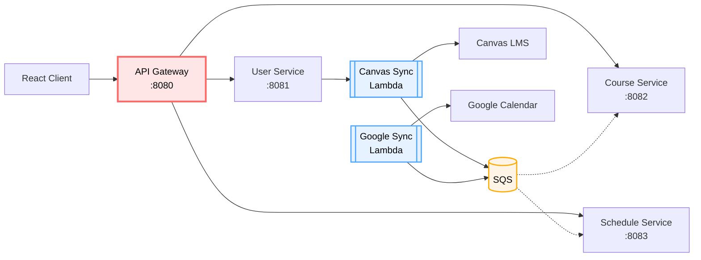

# UniSync

> Canvas LMS 연동 학업 일정관리 서비스

Canvas LMS의 과제와 일정을 자동으로 동기화하여 개인 캘린더와 통합 관리하는 서비스입니다.

## 📌 프로젝트 소개

대학생들은 Canvas LMS, Google Calendar, 개인 일정 등 여러 플랫폼에서 학업 일정을 관리하며 다음과 같은 어려움을 겪습니다:

- 과제 마감일을 놓치거나 중복 입력해야 함
- Canvas와 개인 캘린더 간 수동 동기화 필요
- 그룹 프로젝트에서 팀원 간 일정 공유 어려움

**UniSync는 이러한 문제를 해결합니다**:
- ✅ Canvas 과제를 자동으로 일정/할일로 변환
- ✅ Google Calendar와 양방향 동기화
- ✅ 그룹 프로젝트 일정 공유 및 협업
- 🔮 (Phase 3) AI 기반 과제 분석 및 자동 서브태스크 생성

## 🚀 주요 기능

### ✅ Phase 1 (구현 완료)
- **Canvas 수동 동기화**: 버튼 클릭으로 Canvas 과제를 즉시 동기화
- **과목/과제 관리**: Canvas 수강 과목 및 과제 자동 저장
- **일정/할일 통합**: 시간 단위 일정(Schedule)과 기간 단위 할일(Todo) 통합 관리
- **JWT 인증**: AWS Cognito 기반 사용자 인증

### 🔄 Phase 2 (계획)
- **자동 동기화**: EventBridge 스케줄러로 주기적 자동 동기화
- **Google Calendar 연동**: 양방향 동기화
- **그룹 프로젝트**: 팀원 간 일정 공유 및 협업

### 🤖 Phase 3 (선택)
- **AI 기반 분석**: LLM이 과제를 분석하여 서브태스크 자동 생성
- **제출물 검증**: 제출 파일 분석하여 완료 여부 자동 판단

## 🏗️ 아키텍처



**레이어 구조**:
- **Frontend**: React 클라이언트
- **API Gateway** (:8080): JWT 인증 + Swagger Aggregation
- **Backend Services**: User (:8081), Course (:8082), Schedule (:8083)
- **Serverless**: Canvas/Google Sync Lambda
- **Message Queue**: AWS SQS (비동기 이벤트 처리)

**기술 스택**:
- **Backend**: Java 21, Spring Boot 3.5, Spring Cloud Gateway
- **Auth**: AWS Cognito + JWT
- **Database**: MySQL 8.0 (서비스별 DB 분리)
- **Messaging**: AWS SQS (비동기 이벤트 처리)
- **Serverless**: AWS Lambda, Step Functions
- **Infra**: Docker + LocalStack (로컬 개발)

## 🏃 빠른 시작

### 사전 요구사항
- Docker & Docker Compose
- Java 21 (LTS)
- Python 3.10+ + Poetry (테스트용)

### 1. 저장소 클론
```bash
git clone https://github.com/your-org/UniSync.git
cd UniSync
```

### 2. 환경변수 설정
```bash
# .env.local 템플릿 복사
cp .env.local.example .env.local

# .env.local 파일 편집하여 필요한 값 입력:
# - LOCALSTACK_AUTH_TOKEN (LocalStack Pro)
# - JWT_SECRET
# - ENCRYPTION_KEY
# - CANVAS_API_TOKEN
```

### 3. 인프라 시작
```bash
# LocalStack, MySQL 등 인프라 시작
docker-compose up -d

# LocalStack 초기화 완료 대기 (30초~1분)
docker-compose logs -f localstack | grep "Cognito 설정 완료"
```

### 4. 백엔드 서비스 실행

**옵션 A: IDE에서 개별 실행**
```bash
# User Service
cd app/backend/user-service
./gradlew bootRun --args='--spring.profiles.active=local'

# Course Service, Schedule Service도 동일하게 실행
```

**옵션 B: Docker Compose로 전체 실행**
```bash
# 인수 테스트 환경 (인프라 + 백엔드)
docker-compose -f docker-compose.acceptance.yml up -d --build
```

### 5. 서비스 확인
- **API Gateway**: http://localhost:8080/api/v1/*
- **Swagger UI (Aggregated)**: http://localhost:8080/swagger-ui.html
  - 모든 백엔드 서비스의 API를 하나의 Swagger UI에서 확인 가능
- User Service Swagger: http://localhost:8081/swagger-ui.html
- Course Service Swagger: http://localhost:8082/swagger-ui.html
- Schedule Service Swagger: http://localhost:8083/swagger-ui.html

## 📚 개발 가이드

### 백엔드 개발
- **[app/backend/README.md](app/backend/README.md)** - 환경 설정, 서비스 포트, 실행 방법

### 서버리스 개발
- **[app/serverless/README.md](app/serverless/README.md)** - Lambda 개발, 로컬 테스트 방법

### 테스트
```bash
# 단위 테스트
./gradlew test

# 시스템 테스트 (E2E)
poetry run pytest system-tests/ -v
```

자세한 내용: [system-tests/README.md](system-tests/README.md)

## 📖 문서

프로젝트의 모든 설계 문서는 `docs/` 디렉토리에 체계적으로 정리되어 있습니다.

### 요구사항 및 기획
- **[docs/requirements/product-spec.md](docs/requirements/product-spec.md)** - 프로젝트 기획서, 문제 정의, 핵심 기능

### 설계 문서
- **[docs/design/system-architecture.md](docs/design/system-architecture.md)** - 시스템 아키텍처, API 설계, DB 스키마
- **[docs/design/sqs-architecture.md](docs/design/sqs-architecture.md)** - SQS 큐 목록, 메시지 스키마, 재시도 전략
- **[docs/design/testing-strategy.md](docs/design/testing-strategy.md)** - 테스트 전략, Unit/System Tests

### 기능별 상세 설계
- **[docs/features/canvas-sync.md](docs/features/canvas-sync.md)** - Canvas 동기화 상세 설계 (✅ Phase 1 완료)
- **[docs/features/assignment-to-schedule.md](docs/features/assignment-to-schedule.md)** - 과제 → 일정 변환 로직

### 전체 문서 구조
- **[docs/README.md](docs/README.md)** - 모든 설계 문서 탐색 가이드

## 🤝 기여하기

### 브랜치 전략
- `main`: 안정 버전
- `develop`: 개발 중인 기능들
- `feature/*`: 새 기능 개발
- `fix/*`: 버그 수정

### Pull Request 가이드
1. Issue 생성 또는 기존 Issue 확인
2. 브랜치 생성: `feature/your-feature-name`
3. 코드 작성 및 테스트 추가
4. PR 생성 (템플릿 참고)
5. 코드 리뷰 후 머지

### 코딩 컨벤션
- **DDD 패키지 구조**: 도메인 단위 패키지 (Layer-based 구조 사용 안함)
- **Entity 직접 반환 금지**: 모든 API는 DTO 반환
- **테스트 필수**: Unit Tests (80%) + System Tests (20%)

자세한 내용은 [docs/guides/contributing.md](docs/guides/contributing.md)를 참고하세요.

## 🔍 트러블슈팅

### LocalStack이 시작되지 않는 경우
```bash
# LocalStack 로그 확인
docker-compose logs localstack

# LocalStack 재시작
docker-compose restart localstack
```

### MySQL 연결 실패
```bash
# MySQL 헬스체크 확인
docker-compose ps mysql

# MySQL 로그 확인
docker-compose logs mysql
```

### 환경변수가 로드되지 않는 경우
```bash
# 각 서비스의 환경변수 확인
cd app/backend/user-service
./gradlew printEnv
```

## 📊 프로젝트 현황

- ✅ **Phase 1 완료**: Canvas 수동 동기화
  - User-Service → Lambda 직접 호출 (AWS SDK)
  - Lambda → Canvas API 조회
  - Lambda → SQS 메시지 발행
  - Course-Service → SQS 메시지 consume하여 DB 저장
  - **테스트**: Lambda 15/15, Spring Unit 156개, System 86개 PASS
- 🔄 **Phase 2 계획**: EventBridge 자동 동기화
- 🤖 **Phase 3 선택**: LLM 기반 자동화 (시간 여유 시)

## 📄 라이선스

MIT License

Copyright (c) 2025 UniSync Team

자세한 내용은 [LICENSE](LICENSE) 파일을 참고하세요.
