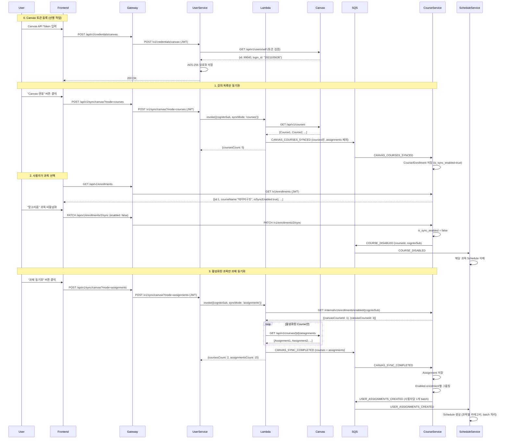

# Canvas LMS 동기화 설계

**버전**: 1.1
**작성일**: 2025-11-20
**최종 수정**: 2025-11-30
**상태**: 🔄 Phase 1.1 개선 진행 중

## 목차
1. [개요](#1-개요)
2. [Phase 1: 수동 동기화](#2-phase-1-수동-동기화)
3. [SQS 큐 설계](#3-sqs-큐-설계)
4. [구현 파일](#4-구현-파일)
5. [테스트](#5-테스트)
6. [Phase 2/3 확장 계획](#6-phase-23-확장-계획)

---

## 1. 개요

### 1.1 배경

Canvas LMS의 과제 및 강의 데이터를 UniSync로 동기화하여 사용자가 일정(Schedule)과 할일(Todo)로 관리할 수 있도록 지원합니다.

**개선 사항**:
- SQS 큐 간소화: 7개 → 3개
- 명확한 큐 네이밍: `{source}-to-{destination}-{purpose}` 형식
- Phase별 명확한 분리: 수동(Phase 1) → 자동(Phase 2) → LLM(Phase 3)
- `syncMode` 명확화: `courses`(과목만) / `assignments`(활성 과목의 과제까지). 이전 이름(`courses_only`/`full`)은 제거.

### 1.2 Phase별 구현 전략

| Phase | 상태 | 설명 | 트리거 |
|-------|------|------|--------|
| **Phase 1.0** | ✅ 완료 | 기본 수동 동기화 (courses+assignments 일괄) | 사용자 버튼 클릭 → Spring → Lambda |
| **Phase 1.1** | 🔄 진행 중 | 과목 선택형 동기화 (과목만 → 사용자 선택 → 과제) | 사용자 선택적 동기화 |
| **Phase 2** | 📋 계획 | 자동 동기화 | EventBridge 스케줄러 → Lambda |
| **Phase 3** | 💡 선택 | LLM 자동화 | Assignment 감지 → LLM 분석 → Subtask 생성 |

### 1.3 핵심 원칙

1. **수동 동기화 우선**: Phase 1에서는 사용자가 명시적으로 동기화 시작
2. **Lambda 재사용**: Phase 1/2/3 모두 동일한 Lambda 함수 사용
3. **응답 즉시성**: Lambda가 동기 응답 (통계) + SQS 비동기 저장
4. **Canvas Token 방식**: OAuth2 대신 사용자가 직접 발급한 API Token 사용 (AES-256 암호화)

---

## 2. Phase 1: 수동 동기화

### 2.1 Phase 1.1: 과목 선택형 동기화 (개선)

**개선 배경**:
- 이미 수료한 과목도 마감일이 없으면 계속 조회됨
- 사용자가 원하지 않는 과목의 과제도 일정으로 생성됨
- 과목별로 동기화 활성화/비활성화 필요

**새로운 플로우** (3단계):
1. **강의 목록만 동기화** (`syncMode: 'courses'`)
2. **사용자가 UI에서 과목 선택** (Enrollment 토글)
3. **과제 동기화** (`syncMode: 'assignments'`, 활성화된 과목만)

### 2.2 전체 플로우



### 2.3 동작 방식

**Step 0: Canvas 토큰 등록 (1회)**
- 사용자가 Canvas에서 발급받은 API Token을 등록
- User-Service가 Canvas API로 토큰 유효성 검증
- AES-256 암호화하여 `credentials` 테이블에 저장

**Step 1: 강의 목록만 동기화**
- 프론트엔드: `POST /api/v1/sync/canvas?mode=courses` (JWT)
- User-Service → Lambda: `{cognitoSub, syncMode: 'courses'}`
- Lambda: Course-Service 내부 API로 `is_sync_enabled=true` 과목 목록 조회
  - 활성 과목이 없으면 Canvas 호출 없이 0건으로 종료
- Lambda: Canvas API에서 courses만 조회 (assignments 제외)
- SQS: `CANVAS_COURSES_SYNCED` 이벤트 발행 (`syncMode=courses`, `courses` 필드만)
- Course-Service: Course + Enrollment upsert

**Step 2: 사용자가 과목 선택**
- 프론트엔드: `GET /api/v1/enrollments` → 과목 목록 조회
- 사용자가 UI에서 원하지 않는 과목 비활성화
- 프론트엔드: `PUT /api/v1/enrollments/{id}/sync {syncEnabled: false}`
- Course-Service: `is_sync_enabled` 플래그 업데이트
- SQS: `COURSE_DISABLED` 이벤트 발행 (Schedule-Service가 해당 과목 Schedule 삭제)

**Step 3: 활성화된 과목만 과제 동기화**
- 프론트엔드: `POST /api/v1/sync/canvas?mode=assignments` (JWT)
- User-Service → Lambda: `{cognitoSub, syncMode: 'assignments'}`
- Lambda → Course-Service: `GET /internal/v1/enrollments/enabled` (헤더 `X-Cognito-Sub`)
  - 활성 과목이 없으면 Canvas 호출 없이 0건으로 종료
- Lambda: 활성화된 과목만 Canvas API에서 assignments 조회 (`dueAt`가 없으면 제외)
- SQS: `CANVAS_SYNC_COMPLETED` 이벤트 발행 (`syncMode=assignments`, assignments 포함)
- Course-Service:
  - Assignment 저장
  - Enabled enrollment별로 그룹핑
  - `USER_ASSIGNMENTS_CREATED` 이벤트 발행 (사용자당 1개 batch 메시지)
- Schedule-Service: 사용자의 모든 assignments를 batch 처리하여 Schedule 생성 (과목별 카테고리)

### 2.4 주요 특징

- **사용자 선택권**: 원하는 과목만 동기화 (수료한 과목 제외 가능)
- **효율적 API 호출**: 활성화된 과목만 Canvas API 호출 (비용/속도 개선)
- **과목별 카테고리**: 모든 과목이 "Canvas" 하나 대신 과목별 카테고리 생성
- **동기 응답**: Lambda가 Canvas API 호출 결과를 즉시 반환 (통계)
- **비동기 저장**: SQS를 통해 DB 저장은 백그라운드에서 처리
- **멱등성 보장**: 중복 동기화 시 동일한 `canvasAssignmentId`는 덮어쓰기 (UNIQUE 제약)
- **Phase 2 호환**: 동일한 Lambda를 EventBridge에서도 호출 가능

---

## 3. SQS 큐 설계

### 3.1 Phase 1 큐

| 큐 이름 | 송신자 | 수신자 | 용도 | 상태 |
|---------|--------|--------|------|------|
| `lambda-to-courseservice-sync` | Lambda | Course-Service | Canvas 동기화 통합 메시지 (courses/assignments) | ✅ |
| `courseservice-to-scheduleservice-assignments` | Course-Service | Schedule-Service | Assignment → Schedule 변환 | ✅ |
| `courseservice-to-scheduleservice-courses` | Course-Service | Schedule-Service | Course 비활성화 이벤트 (`COURSE_DISABLED`) | ✅ |
| `dlq-queue` | - | - | 처리 실패 메시지 저장 (DLQ) | ✅ |

### 3.2 큐 메시지 형식

#### 3.2.1 Canvas 동기화 메시지 (`lambda-to-courseservice-sync`)

**Phase 1.1 개선**: 기존 분리 메시지 → 1개 통합 큐로 변경
- 이벤트 타입으로 구분: `CANVAS_COURSES_SYNCED`(courses), `CANVAS_SYNC_COMPLETED`(assignments)
- `syncMode` 필드: `courses`/`assignments`
- 활성 enrollments가 없으면 0건 메시지 반환, SQS 발행 생략

**강의 목록만 동기화** (`CANVAS_COURSES_SYNCED`):
```json
{
  "eventType": "CANVAS_COURSES_SYNCED",
  "syncMode": "courses",
  "cognitoSub": "user-cognito-sub-123",
  "syncedAt": "2025-11-30T12:00:00Z",
  "courses": [
    {
      "canvasCourseId": 456,
      "courseName": "데이터구조",
      "courseCode": "CS201",
      "workflowState": "available",
      "startAt": "2025-09-01T00:00:00",
      "endAt": "2025-12-15T23:59:59"
    }
  ]
}
```

**전체 동기화** (`CANVAS_SYNC_COMPLETED`):
```json
{
  "eventType": "CANVAS_SYNC_COMPLETED",
  "syncMode": "assignments",
  "cognitoSub": "user-cognito-sub-123",
  "syncedAt": "2025-11-30T12:00:00Z",
  "courses": [
    {
      "canvasCourseId": 456,
      "courseName": "데이터구조",
      "courseCode": "CS201",
      "workflowState": "available",
      "startAt": "2025-09-01T00:00:00",
      "endAt": "2025-12-15T23:59:59",
      "assignments": [
        {
          "canvasAssignmentId": 1001,
          "title": "중간고사 프로젝트",
          "description": "<p>Develop Spring Boot web application</p>",
          "dueAt": "2025-11-15T23:59:00",
          "pointsPossible": 100,
          "submissionTypes": "online_upload",
          "htmlUrl": "https://canvas.instructure.com/courses/456/assignments/1001",
          "createdAt": "2025-09-01T10:00:00",
          "updatedAt": "2025-09-05T15:30:00"
        }
      ]
    }
  ]
}
```

**차이점**:
- `CANVAS_COURSES_SYNCED`: `assignments` 필드 없음 (courses)
- `CANVAS_SYNC_COMPLETED`: `assignments` 필드 포함 (assignments), `dueAt`가 null인 과제는 제외

#### 3.2.2 Course 이벤트 메시지 (`courseservice-to-scheduleservice-course-events`)

**과목 비활성화** (`COURSE_DISABLED`):
```json
{
  "eventType": "COURSE_DISABLED",
  "cognitoSub": "user-cognito-sub-123",
  "courseId": 10,
  "canvasCourseId": 456,
  "courseName": "알고리즘"
}
```

**용도**: Schedule-Service가 해당 과목의 모든 Schedule 삭제

### 3.3 Phase 2/3 큐 (향후 추가 예정)

| 큐 이름 | 용도 | Phase |
|---------|------|-------|
| `submission-events-queue` | 제출물 감지 및 처리 | Phase 3 |
| `task-creation-queue` | LLM 기반 서브태스크 생성 | Phase 3 |

---

## 4. 구현 파일

### 4.1 Lambda

**핸들러**:
- `app/serverless/canvas-sync-lambda/src/handler.py`
  - `lambda_handler()`: 메인 핸들러
  - `extract_cognito_sub()`: Phase 1/2/3 입력 형식 정규화
  - `get_canvas_token()`: User-Service에서 복호화된 토큰 조회
  - `fetch_user_courses()`: Canvas API - 사용자 수강 과목 조회
  - `fetch_canvas_assignments()`: Canvas API - 과목별 과제 조회
  - `send_to_sqs()`: SQS 메시지 발행

### 4.2 User-Service

**Canvas 동기화**:
- `com/unisync/user/sync/controller/SyncController.java`: POST /v1/sync/canvas
- `com/unisync/user/sync/service/CanvasSyncService.java`: Lambda 호출 로직
- `com/unisync/user/sync/dto/CanvasSyncResponse.java`: 동기화 응답 DTO
- `com/unisync/user/sync/exception/CanvasSyncException.java`: 예외 처리

**설정**:
- `com/unisync/user/common/config/AwsLambdaConfig.java`: LambdaClient Bean
- `com/unisync/user/common/util/JwtUtil.java`: JWT에서 cognitoSub 추출

**예외 처리**:
- `com/unisync/user/common/exception/GlobalExceptionHandler.java`: `@ExceptionHandler(CanvasSyncException.class)`

### 4.3 Course-Service

**SQS 리스너**:
- `com/unisync/course/course/listener/CourseEnrollmentListener.java`: `lambda-to-courseservice-enrollments` 수신
- `com/unisync/course/assignment/listener/AssignmentEventListener.java`: `lambda-to-courseservice-assignments` 수신

### 4.4 환경변수

**공통 설정** (`.env.common`):
```bash
SQS_COURSE_ENROLLMENT_QUEUE=lambda-to-courseservice-enrollments
SQS_ASSIGNMENT_EVENTS_QUEUE=lambda-to-courseservice-assignments
SQS_DLQ_QUEUE=dlq-queue
AWS_LAMBDA_ENDPOINT_URL=http://localstack:4566
CANVAS_SYNC_LAMBDA_FUNCTION_NAME=canvas-sync-lambda
```

**로컬 개발** (`.env.local`): 위 내용 + 비밀 정보 (ENCRYPTION_KEY, API 키 등)

### 4.5 LocalStack 초기화

**SQS 큐 생성**:
- `localstack-init/01-create-queues.sh`: Phase 1 큐 3개 생성

---

## 5. 테스트

### 5.1 Lambda 단위 테스트

**파일**: `app/serverless/canvas-sync-lambda/tests/test_canvas_handler.py`

**실행**:
```bash
cd app/serverless/canvas-sync-lambda
pytest tests/test_canvas_handler.py -v
```

**결과**: ✅ 15/15 tests passed

### 5.2 Spring 단위 테스트

**파일**:
- `com/unisync/user/sync/service/CanvasSyncServiceTest.java` (6개 테스트)
- `com/unisync/user/sync/controller/SyncControllerTest.java` (6개 테스트)

**실행**:
```bash
cd app/backend/user-service
./gradlew test --tests "com.unisync.user.sync.*"
```

**결과**: ✅ 12/12 tests passed

### 5.3 통합 테스트

**파일**: `tests/integration/test_canvas_sync_integration.py` (6개 테스트)

**실행**:
```bash
cd tests/integration
pytest test_canvas_sync_integration.py -v
```

**테스트 항목**:
- 전체 플로우 (Lambda → Canvas API → SQS → DB)
- SQS 메시지 형식 검증
- 멱등성 테스트
- Canvas 토큰 없는 사용자 시나리오
- Phase 2 이벤트 형식 호환성

자세한 테스트 전략은 [`testing-strategy.md`](./testing-strategy.md) 참고.

---

## 6. Phase 2/3 확장 계획

### 6.1 Phase 2: 자동 동기화 (계획)

**트리거**: EventBridge 스케줄러 (예: 매일 오전 6시)

**플로우**:
```
EventBridge Rule (cron)
  → Dispatcher Lambda (사용자 목록 조회)
  → Canvas-Sync-Lambda (각 사용자별)
  → SQS (동일한 큐 사용)
  → Course-Service (동일한 리스너)
```

**변경 사항**:
- `extract_cognito_sub()` 함수가 EventBridge 형식도 지원 (이미 구현됨)
- Dispatcher Lambda 신규 작성 필요
- EventBridge Rule 설정 필요

### 6.2 Phase 3: LLM 자동화 (선택)

**기능**:
1. **과제 자동 분석**: 새 과제 감지 → LLM이 설명 분석 → 서브태스크 자동 생성
2. **제출물 자동 검증**: 제출 감지 → LLM이 검증 → 유효하면 Task 상태 DONE

**추가 구성 요소**:
- `submission-events-queue`: 제출물 이벤트 큐
- `task-creation-queue`: LLM이 생성한 서브태스크 큐
- LLM Lambda: 과제 분석 및 제출물 검증

**고려 사항**:
- LLM API 비용
- 응답 시간 (비동기 처리 필수)
- 프롬프트 엔지니어링

---

## 7. 참고 문서

- [테스트 전략](./testing-strategy.md) - 단위/통합/E2E 테스트 가이드
- [시스템 아키텍처](../design/system-architecture.md) - 전체 시스템 설계
- [Backend 가이드](../../app/backend/CLAUDE.md) - 환경변수, 프로파일 관리
- [Serverless 가이드](../../app/serverless/CLAUDE.md) - Lambda, SQS 스키마

---

## 8. 구현 체크리스트

### Phase 1.0: 기본 수동 동기화 ✅

#### Lambda
- [x] `lambda_handler()` 재작성 (Phase 1/2/3 공통)
- [x] `extract_cognito_sub()` 추가 (입력 형식 정규화)
- [x] `fetch_user_courses()` 추가 (Canvas API)
- [x] 통합 메시지 발행 (단일 SQS)
- [x] 단위 테스트 작성 및 통과 (15/15)

#### User-Service
- [x] `AwsLambdaConfig` 작성 (LambdaClient Bean)
- [x] `JwtUtil` 작성 (cognitoSub 추출)
- [x] `CanvasSyncService` 작성 (Lambda 호출)
- [x] `SyncController` 작성 (POST /v1/sync/canvas)
- [x] `CanvasSyncException` 핸들러 추가
- [x] 단위 테스트 작성 및 통과 (12/12)

#### Course-Service
- [x] `CanvasSyncListener` 통합 메시지 처리
- [x] `AssignmentService` Assignment 저장 후 이벤트 발행
- [x] `AssignmentEventPublisher` SQS 발행

#### Schedule-Service
- [x] `AssignmentListener` SQS 메시지 consume
- [x] `AssignmentService` Assignment → Schedule 변환
- [x] dueAt null 처리 (CREATE: 건너뛰기, UPDATE: 삭제)
- [x] 단위 테스트 작성 및 통과

#### 환경변수
- [x] `.env.common` 업데이트
- [x] `AWS_LAMBDA_ENDPOINT_URL` 환경변수 추가
- [x] `CANVAS_SYNC_LAMBDA_FUNCTION_NAME` 추가

#### LocalStack
- [x] `01-create-queues.sh` 업데이트

#### 문서
- [x] `canvas-sync.md` 작성
- [x] `assignment-to-schedule.md` 작성
- [x] `CLAUDE.md` 링크 추가

---

### Phase 1.1: 과목 선택형 동기화 🔄

#### 데이터 모델
- [ ] `Enrollment` 엔티티: `is_sync_enabled` 컬럼 추가 (BOOLEAN, DEFAULT true)
- [ ] `Category` 엔티티: `source_type`, `source_id` 컬럼 추가 (과목별 카테고리)
- [ ] Migration 스크립트 작성

#### Lambda
- [ ] `syncMode` 파라미터 처리 ('courses' | 'assignments')
- [ ] `courses` 모드: assignments 조회 건너뛰기
- [ ] `assignments` 모드: Course-Service에서 활성화된 enrollment 조회
- [ ] `assignments` 모드: 활성화된 과목만 assignments 조회
- [ ] `get_enabled_enrollments()` 함수 추가
- [ ] 이벤트 타입 구분: `CANVAS_COURSES_SYNCED`, `CANVAS_SYNC_COMPLETED`
- [ ] 단위 테스트 업데이트

#### User-Service
- [ ] `SyncController`: `mode` 쿼리 파라미터 지원
- [ ] `CanvasSyncService`: Lambda 호출 시 `syncMode` 전달
- [ ] 단위 테스트 업데이트

#### Course-Service
- [ ] `CanvasSyncListener`: 이벤트 타입별 분기 처리
  - `CANVAS_COURSES_SYNCED`: Course + Enrollment만 생성
  - `CANVAS_SYNC_COMPLETED`: 기존 로직 (Course + Assignment)
- [ ] `EnrollmentController`:
  - `GET /v1/enrollments` (과목 목록 조회)
  - `PATCH /v1/enrollments/{id}/sync` (토글 API)
- [ ] `EnrollmentService`:
  - `toggleSync()` 메서드 추가
  - 비활성화 시 `COURSE_DISABLED` 이벤트 발행
- [ ] `EnrollmentInternalController`:
  - `GET /internal/v1/enrollments/enabled/{cognitoSub}` (Lambda용)
- [ ] `CourseEventPublisher`: `COURSE_DISABLED` 이벤트 발행
- [ ] `AssignmentService`: 활성화된 enrollment 학생들에게만 이벤트 발행
- [ ] 단위 테스트 작성

#### Schedule-Service
- [ ] `CourseEventListener`: `COURSE_DISABLED` 이벤트 처리
- [ ] `ScheduleService`: 과목별 Schedule 삭제 메서드
- [ ] `CategoryService`:
  - `getOrCreateCourseCategory()` 과목별 카테고리 생성
  - source_type, source_id로 중복 방지
- [ ] `AssignmentService`: 과목별 카테고리 사용
- [ ] 단위 테스트 작성

#### LocalStack
- [ ] `01-create-queues.sh`: `courseservice-to-scheduleservice-course-events` 큐 추가

#### 환경변수
- [ ] `.env.common`: 새 큐 이름 추가

#### 통합 테스트
- [ ] 강의 목록만 동기화 테스트
- [ ] 과목 비활성화 시 Schedule 삭제 테스트
- [ ] 활성화된 과목만 과제 동기화 테스트
- [ ] 과목별 카테고리 생성 테스트

#### 문서
- [ ] `canvas-sync.md` 업데이트 (Phase 1.1 반영)
- [ ] `assignment-to-schedule.md` 업데이트 (과목별 카테고리, dueAt null 처리)
- [ ] API 문서 업데이트
