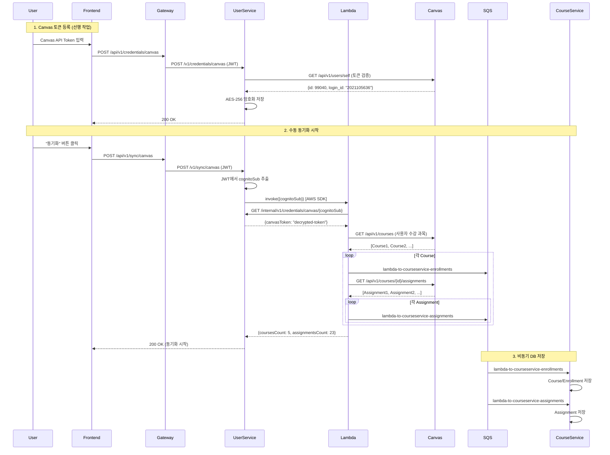

# Canvas LMS 동기화 설계

**버전**: 1.0
**작성일**: 2025-11-20
**최종 수정**: 2025-11-20
**상태**: ✅ Phase 1 구현 완료

## 목차
1. [개요](#1-개요)
2. [Phase 1: 수동 동기화](#2-phase-1-수동-동기화)
3. [SQS 큐 설계](#3-sqs-큐-설계)
4. [구현 파일](#4-구현-파일)
5. [테스트](#5-테스트)
6. [Phase 2/3 확장 계획](#6-phase-23-확장-계획)

---

## 1. 개요

### 1.1 배경

Canvas LMS의 과제 및 강의 데이터를 UniSync로 동기화하여 사용자가 일정(Schedule)과 할일(Todo)로 관리할 수 있도록 지원합니다.

**개선 사항**:
- SQS 큐 간소화: 7개 → 3개
- 명확한 큐 네이밍: `{source}-to-{destination}-{purpose}` 형식
- Phase별 명확한 분리: 수동(Phase 1) → 자동(Phase 2) → LLM(Phase 3)

### 1.2 Phase별 구현 전략

| Phase | 상태 | 설명 | 트리거 |
|-------|------|------|--------|
| **Phase 1** | ✅ 완료 | 수동 동기화 | 사용자 버튼 클릭 → Spring → Lambda |
| **Phase 2** | 📋 계획 | 자동 동기화 | EventBridge 스케줄러 → Lambda |
| **Phase 3** | 💡 선택 | LLM 자동화 | Assignment 감지 → LLM 분석 → Subtask 생성 |

### 1.3 핵심 원칙

1. **수동 동기화 우선**: Phase 1에서는 사용자가 명시적으로 동기화 시작
2. **Lambda 재사용**: Phase 1/2/3 모두 동일한 Lambda 함수 사용
3. **응답 즉시성**: Lambda가 동기 응답 (통계) + SQS 비동기 저장
4. **Canvas Token 방식**: OAuth2 대신 사용자가 직접 발급한 API Token 사용 (AES-256 암호화)

---

## 2. Phase 1: 수동 동기화

### 2.1 전체 플로우



### 2.2 동작 방식

**1단계: Canvas 토큰 등록**
- 사용자가 Canvas에서 발급받은 API Token을 등록
- User-Service가 Canvas API로 토큰 유효성 검증
- AES-256 암호화하여 `credentials` 테이블에 저장

**2단계: 수동 동기화 요청**
- 프론트엔드: `POST /api/v1/sync/canvas` (JWT)
- User-Service: JWT에서 `cognitoSub` 추출 → Lambda 동기 호출
- Lambda: 즉시 응답 반환 (`coursesCount`, `assignmentsCount`)

**3단계: 비동기 저장**
- Lambda가 SQS에 메시지 발행
- Course-Service가 SQS 리스너로 메시지 소비하여 DB 저장

### 2.3 주요 특징

- **동기 응답**: Lambda가 Canvas API 호출 결과를 즉시 반환 (통계)
- **비동기 저장**: SQS를 통해 DB 저장은 백그라운드에서 처리
- **멱등성 보장**: 중복 동기화 시 동일한 `canvasAssignmentId`는 덮어쓰기 (UNIQUE 제약)
- **Phase 2 호환**: 동일한 Lambda를 EventBridge에서도 호출 가능

---

## 3. SQS 큐 설계

### 3.1 Phase 1 큐 (구현 완료)

| 큐 이름 | 송신자 | 수신자 | 용도 | 상태 |
|---------|--------|--------|------|------|
| `lambda-to-courseservice-enrollments` | Lambda | Course-Service | Course 및 Enrollment 데이터 전송 | ✅ |
| `lambda-to-courseservice-assignments` | Lambda | Course-Service | Assignment 데이터 전송 | ✅ |
| `dlq-queue` | - | - | 처리 실패 메시지 저장 (DLQ) | ✅ |

### 3.2 큐 메시지 형식

**Enrollment 메시지** (`lambda-to-courseservice-enrollments`):
```json
{
  "cognitoSub": "user-cognito-sub-123",
  "canvasCourseId": 456,
  "courseName": "Software Engineering",
  "courseCode": "CS401",
  "workflowState": "available",
  "startAt": "2025-09-01T00:00:00",
  "endAt": "2025-12-15T23:59:59",
  "publishedAt": "2025-11-20T12:00:00Z"
}
```

**Assignment 메시지** (`lambda-to-courseservice-assignments`):
```json
{
  "eventType": "ASSIGNMENT_CREATED",
  "canvasCourseId": 456,
  "canvasAssignmentId": 1001,
  "title": "Midterm Project",
  "description": "<p>Develop Spring Boot web application</p>",
  "dueAt": "2025-11-15T23:59:00",
  "pointsPossible": 100,
  "submissionTypes": "online_upload",
  "htmlUrl": "https://canvas.instructure.com/courses/456/assignments/1001",
  "createdAt": "2025-09-01T10:00:00",
  "updatedAt": "2025-09-05T15:30:00"
}
```

### 3.3 Phase 2/3 큐 (향후 추가 예정)

| 큐 이름 | 용도 | Phase |
|---------|------|-------|
| `submission-events-queue` | 제출물 감지 및 처리 | Phase 3 |
| `task-creation-queue` | LLM 기반 서브태스크 생성 | Phase 3 |

---

## 4. 구현 파일

### 4.1 Lambda

**핸들러**:
- `app/serverless/canvas-sync-lambda/src/handler.py`
  - `lambda_handler()`: 메인 핸들러
  - `extract_cognito_sub()`: Phase 1/2/3 입력 형식 정규화
  - `get_canvas_token()`: User-Service에서 복호화된 토큰 조회
  - `fetch_user_courses()`: Canvas API - 사용자 수강 과목 조회
  - `fetch_canvas_assignments()`: Canvas API - 과목별 과제 조회
  - `send_to_sqs()`: SQS 메시지 발행

### 4.2 User-Service

**Canvas 동기화**:
- `com/unisync/user/sync/controller/SyncController.java`: POST /v1/sync/canvas
- `com/unisync/user/sync/service/CanvasSyncService.java`: Lambda 호출 로직
- `com/unisync/user/sync/dto/CanvasSyncResponse.java`: 동기화 응답 DTO
- `com/unisync/user/sync/exception/CanvasSyncException.java`: 예외 처리

**설정**:
- `com/unisync/user/common/config/AwsLambdaConfig.java`: LambdaClient Bean
- `com/unisync/user/common/util/JwtUtil.java`: JWT에서 cognitoSub 추출

**예외 처리**:
- `com/unisync/user/common/exception/GlobalExceptionHandler.java`: `@ExceptionHandler(CanvasSyncException.class)`

### 4.3 Course-Service

**SQS 리스너**:
- `com/unisync/course/course/listener/CourseEnrollmentListener.java`: `lambda-to-courseservice-enrollments` 수신
- `com/unisync/course/assignment/listener/AssignmentEventListener.java`: `lambda-to-courseservice-assignments` 수신

### 4.4 환경변수

**공통 설정** (`.env.common`):
```bash
SQS_COURSE_ENROLLMENT_QUEUE=lambda-to-courseservice-enrollments
SQS_ASSIGNMENT_EVENTS_QUEUE=lambda-to-courseservice-assignments
SQS_DLQ_QUEUE=dlq-queue
AWS_LAMBDA_ENDPOINT_URL=http://localstack:4566
CANVAS_SYNC_LAMBDA_FUNCTION_NAME=canvas-sync-lambda
```

**로컬 개발** (`.env.local`): 위 내용 + 비밀 정보 (ENCRYPTION_KEY, API 키 등)

### 4.5 LocalStack 초기화

**SQS 큐 생성**:
- `localstack-init/01-create-queues.sh`: Phase 1 큐 3개 생성

---

## 5. 테스트

### 5.1 Lambda 단위 테스트

**파일**: `app/serverless/canvas-sync-lambda/tests/test_canvas_handler.py`

**실행**:
```bash
cd app/serverless/canvas-sync-lambda
pytest tests/test_canvas_handler.py -v
```

**결과**: ✅ 15/15 tests passed

### 5.2 Spring 단위 테스트

**파일**:
- `com/unisync/user/sync/service/CanvasSyncServiceTest.java` (6개 테스트)
- `com/unisync/user/sync/controller/SyncControllerTest.java` (6개 테스트)

**실행**:
```bash
cd app/backend/user-service
./gradlew test --tests "com.unisync.user.sync.*"
```

**결과**: ✅ 12/12 tests passed

### 5.3 통합 테스트

**파일**: `tests/integration/test_canvas_sync_integration.py` (6개 테스트)

**실행**:
```bash
cd tests/integration
pytest test_canvas_sync_integration.py -v
```

**테스트 항목**:
- 전체 플로우 (Lambda → Canvas API → SQS → DB)
- SQS 메시지 형식 검증
- 멱등성 테스트
- Canvas 토큰 없는 사용자 시나리오
- Phase 2 이벤트 형식 호환성

자세한 테스트 전략은 [`testing-strategy.md`](./testing-strategy.md) 참고.

---

## 6. Phase 2/3 확장 계획

### 6.1 Phase 2: 자동 동기화 (계획)

**트리거**: EventBridge 스케줄러 (예: 매일 오전 6시)

**플로우**:
```
EventBridge Rule (cron)
  → Dispatcher Lambda (사용자 목록 조회)
  → Canvas-Sync-Lambda (각 사용자별)
  → SQS (동일한 큐 사용)
  → Course-Service (동일한 리스너)
```

**변경 사항**:
- `extract_cognito_sub()` 함수가 EventBridge 형식도 지원 (이미 구현됨)
- Dispatcher Lambda 신규 작성 필요
- EventBridge Rule 설정 필요

### 6.2 Phase 3: LLM 자동화 (선택)

**기능**:
1. **과제 자동 분석**: 새 과제 감지 → LLM이 설명 분석 → 서브태스크 자동 생성
2. **제출물 자동 검증**: 제출 감지 → LLM이 검증 → 유효하면 Task 상태 DONE

**추가 구성 요소**:
- `submission-events-queue`: 제출물 이벤트 큐
- `task-creation-queue`: LLM이 생성한 서브태스크 큐
- LLM Lambda: 과제 분석 및 제출물 검증

**고려 사항**:
- LLM API 비용
- 응답 시간 (비동기 처리 필수)
- 프롬프트 엔지니어링

---

## 7. 참고 문서

- [테스트 전략](./testing-strategy.md) - 단위/통합/E2E 테스트 가이드
- [시스템 아키텍처](../design/system-architecture.md) - 전체 시스템 설계
- [Backend 가이드](../../app/backend/CLAUDE.md) - 환경변수, 프로파일 관리
- [Serverless 가이드](../../app/serverless/CLAUDE.md) - Lambda, SQS 스키마

---

## 8. 구현 완료 체크리스트

### Phase 1: 수동 동기화

#### Lambda
- [x] `lambda_handler()` 재작성 (Phase 1/2/3 공통)
- [x] `extract_cognito_sub()` 추가 (입력 형식 정규화)
- [x] `fetch_user_courses()` 추가 (Canvas API)
- [x] 새 큐 이름으로 메시지 발행
- [x] 단위 테스트 작성 및 통과 (15/15)

#### User-Service
- [x] `AwsLambdaConfig` 작성 (LambdaClient Bean)
- [x] `JwtUtil` 작성 (cognitoSub 추출)
- [x] `CanvasSyncService` 작성 (Lambda 호출)
- [x] `SyncController` 작성 (POST /v1/sync/canvas)
- [x] `CanvasSyncException` 핸들러 추가
- [x] 단위 테스트 작성 및 통과 (12/12)

#### Course-Service
- [x] `CourseEnrollmentListener` 큐 이름 변경
- [x] `AssignmentEventListener` 큐 이름 변경
- [x] 불필요한 SQS 발행 로직 제거

#### 환경변수
- [x] `.env.common` 업데이트 (새 큐 이름)
- [x] `.env.local.example` 업데이트
- [x] `AWS_LAMBDA_ENDPOINT_URL` 환경변수 추가
- [x] `CANVAS_SYNC_LAMBDA_FUNCTION_NAME` 추가

#### LocalStack
- [x] `01-create-queues.sh` 업데이트 (3개 큐만 생성)
- [x] 기존 7개 큐 제거

#### 테스트
- [x] Lambda 단위 테스트 작성 및 통과
- [x] Spring 단위 테스트 작성 및 통과
- [x] 통합 테스트 작성

#### 문서
- [x] `canvas-sync.md` 작성 (설계 문서)
- [x] `testing-strategy.md` 작성 (테스트 전략)
- [x] `CLAUDE.md` 링크 추가
- [x] `README.md` 링크 추가
