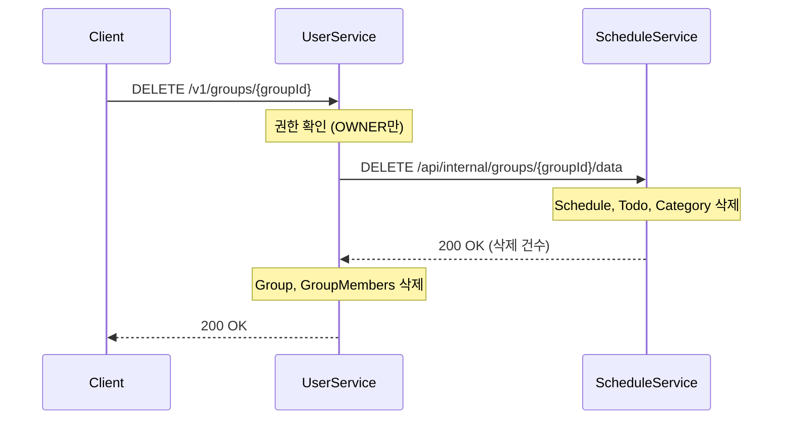

# 소셜 기능 및 그룹 관리

**버전**: 1.1
**작성일**: 2025-11-22
**최종 수정**: 2025-11-22
**상태**: ✅ 구현 완료

## 목차
1. [개요](#1-개요)
2. [친구 관리](#2-친구-관리)
3. [그룹 관리](#3-그룹-관리)
4. [그룹-일정 연동](#4-그룹-일정-연동)
5. [그룹 일정/할일/카테고리 조회](#5-그룹-일정할일카테고리-조회)
6. [API 설계](#6-api-설계)
7. [데이터 모델](#7-데이터-모델)
8. [테스트](#8-테스트)

---

## 1. 개요

### 1.1 목표

- **친구 관리**: 사용자 간 친구 관계 설정 (친구 요청, 수락, 차단)
- **그룹 관리**: 협업을 위한 그룹 생성 및 멤버 관리
- **권한 관리**: 그룹 내 역할 기반 권한 (OWNER, ADMIN, MEMBER)
- **일정 연동**: 그룹 삭제 시 Schedule 데이터 cascade 삭제

### 1.2 주요 기능

| 기능 | 설명 |
|------|------|
| 친구 검색 | 이메일로 사용자 검색 |
| 친구 요청 | 요청 발송, 수락/거절 |
| 친구 차단 | 차단/해제 |
| 그룹 생성 | 소유자 자동 설정 |
| 멤버 관리 | 초대, 역할 변경, 제거 |
| 그룹 삭제 | OWNER만 가능, Schedule 데이터 cascade 삭제 |

### 1.3 그룹 권한

| 역할 | 그룹 수정 | 멤버 초대 | 멤버 제거 | 역할 변경 | 그룹 삭제 | 일정 CRUD |
|------|----------|----------|----------|----------|----------|----------|
| **OWNER** | ✅ | ✅ | ✅ 전체 | ✅ | ✅ | ✅ |
| **ADMIN** | ❌ | ✅ | ✅ MEMBER만 | ❌ | ❌ | ✅ |
| **MEMBER** | ❌ | ❌ | ❌ | ❌ | ❌ | 조회만 |

---

## 2. 친구 관리

### 2.1 친구 관계 상태

| 상태 | 설명 |
|------|------|
| `PENDING` | 친구 요청 대기 중 |
| `ACCEPTED` | 친구 관계 성립 (양방향) |
| `BLOCKED` | 차단됨 |

### 2.2 양방향 관계

- User A → User B 요청 수락 시:
  - Friendship(A → B, ACCEPTED)
  - Friendship(B → A, ACCEPTED)
- 양방향 관계를 명시적으로 저장하여 조회 성능 향상

---

## 3. 그룹 관리

### 3.1 그룹 생성

```
POST /v1/groups
→ Groups 생성 (owner_cognito_sub = JWT.cognitoSub)
→ GroupMembers 생성 (role = OWNER)
```

### 3.2 그룹 탈퇴

- OWNER가 탈퇴 시: 다른 멤버 있으면 에러 (소유권 이전 필요)
- 마지막 멤버 탈퇴 시: 그룹 자동 삭제 + Schedule 데이터 cascade 삭제

### 3.3 그룹 삭제

- OWNER만 삭제 가능
- Schedule-Service Internal API 호출하여 그룹 일정/할일/카테고리 삭제

---

## 4. 그룹-일정 연동

### 4.1 아키텍처

```
User-Service                              Schedule-Service
┌─────────────────────┐                   ┌─────────────────────┐
│ GroupService        │                   │ GroupPermissionSvc  │
│   deleteGroup()     │── Internal API ──►│   validateWrite()   │
│   leaveGroup()      │   (동기 호출)      │                     │
└─────────────────────┘                   └─────────────────────┘
┌─────────────────────┐                   ┌─────────────────────┐
│ InternalGroupCtrl   │◄── Internal API ──│ UserServiceClient   │
│   getMembership()   │   (동기 호출)      │   getMembership()   │
└─────────────────────┘                   └─────────────────────┘
```

### 4.2 그룹 일정 권한 체크

Schedule-Service에서 그룹 일정/할일/카테고리 CRUD 시 User-Service Internal API 호출:

```
Schedule-Service                User-Service
     │                              │
     │ GET /api/internal/groups/    │
     │     {groupId}/members/       │
     │     {cognitoSub}             │
     │─────────────────────────────►│
     │                              │
     │ { member: true,              │
     │   role: "ADMIN" }            │
     │◄─────────────────────────────│
```

### 4.3 그룹 삭제 시 일정 삭제



### 4.4 Internal API

#### User-Service

```
GET /api/internal/groups/{groupId}/members/{cognitoSub}

Response:
{
  "groupId": 1,
  "cognitoSub": "abc-123",
  "member": true,        // Java boolean isMember → JSON "member"
  "role": "ADMIN"        // null if not member
}
```

#### Schedule-Service

```
DELETE /api/internal/groups/{groupId}/data

Response:
{
  "groupId": 1,
  "success": true,
  "deletedSchedules": 5,
  "deletedTodos": 12,
  "deletedCategories": 3
}
```

---

## 5. 그룹 일정/할일/카테고리 조회

### 5.1 조회 파라미터

모든 Schedule-Service API(일정, 할일, 카테고리)는 일관된 그룹 조회 파라미터를 지원합니다:

| 파라미터 | 설명 | 우선순위 |
|---------|------|---------|
| `groupId` | 특정 그룹의 데이터만 조회 | 최우선 (이 파라미터가 있으면 `includeGroups`는 무시됨) |
| `includeGroups` | 개인 + 사용자가 속한 모든 그룹의 데이터 통합 조회 | 2순위 |
| 파라미터 없음 | 개인 데이터만 조회 | 기본값 |

### 5.2 일정 조회 (Schedules)

```bash
# 개인 일정만
GET /api/v1/schedules

# 특정 그룹 일정
GET /api/v1/schedules?groupId=123

# 개인 + 모든 그룹 일정 통합
GET /api/v1/schedules?includeGroups=true

# includeGroups + 상태 필터
GET /api/v1/schedules?includeGroups=true&status=DONE
```

**동작 방식**:
- `groupId` 파라미터가 있는 경우:
  - User-Service Internal API로 그룹 멤버십 확인 (읽기 권한)
  - 해당 그룹의 일정만 조회 (`group_id = {groupId}`)

- `includeGroups=true`인 경우:
  - User-Service Internal API로 사용자가 속한 모든 그룹 목록 조회
  - 개인 일정 (`cognito_sub = {cognitoSub} AND group_id IS NULL`) + 모든 그룹 일정 (`group_id IN (...)`) 통합 조회

### 5.3 할일 조회 (Todos)

```bash
# 개인 할일만
GET /api/v1/todos

# 특정 그룹 할일
GET /api/v1/todos?groupId=123

# 개인 + 모든 그룹 할일 통합
GET /api/v1/todos?includeGroups=true

# includeGroups + 우선순위 필터
GET /api/v1/todos?includeGroups=true&priority=HIGH
```

**동작 방식**: 일정 조회와 동일

### 5.4 카테고리 조회 (Categories)

```bash
# 개인 카테고리만
GET /api/v1/categories

# 특정 그룹 카테고리
GET /api/v1/categories?groupId=123

# 개인 + 모든 그룹 카테고리 통합
GET /api/v1/categories?includeGroups=true

# includeGroups + sourceType 필터
GET /api/v1/categories?includeGroups=true&sourceType=USER_CREATED
```

**동작 방식**: 일정 조회와 동일

### 5.5 권한 검증

| 역할 | 조회 권한 | 생성/수정/삭제 권한 |
|------|---------|-------------------|
| **OWNER** | ✅ | ✅ |
| **ADMIN** | ✅ | ✅ |
| **MEMBER** | ✅ | ❌ (읽기 전용) |
| 비멤버 | ❌ | ❌ |

**권한 검증 플로우**:
```
Schedule-Service
  → User-Service Internal API: GET /api/internal/groups/{groupId}/members/{cognitoSub}
  → Response: { "member": true, "role": "MEMBER" }
  → 읽기: member=true이면 허용
  → 쓰기: role이 OWNER 또는 ADMIN이면 허용
```

---

## 6. API 설계

### 6.1 친구 API

| Method | Endpoint | 설명 |
|--------|----------|------|
| GET | `/v1/friends/search?query=` | 사용자 검색 |
| POST | `/v1/friends/requests` | 친구 요청 |
| GET | `/v1/friends/requests/pending` | 받은 요청 목록 |
| POST | `/v1/friends/requests/{id}/accept` | 요청 수락 |
| POST | `/v1/friends/requests/{id}/reject` | 요청 거절 |
| GET | `/v1/friends` | 친구 목록 |
| DELETE | `/v1/friends/{friendshipId}` | 친구 삭제 |
| POST | `/v1/friends/{cognitoSub}/block` | 차단 |

### 6.2 그룹 API

| Method | Endpoint | 권한 | 설명 |
|--------|----------|------|------|
| POST | `/v1/groups` | 인증 | 그룹 생성 |
| GET | `/v1/groups` | 인증 | 내 그룹 목록 |
| GET | `/v1/groups/{groupId}` | 멤버 | 그룹 상세 |
| PUT | `/v1/groups/{groupId}` | OWNER | 그룹 수정 |
| DELETE | `/v1/groups/{groupId}` | OWNER | 그룹 삭제 |
| POST | `/v1/groups/{groupId}/members` | OWNER/ADMIN | 멤버 초대 |
| GET | `/v1/groups/{groupId}/members` | 멤버 | 멤버 목록 |
| PATCH | `/v1/groups/{groupId}/members/{memberId}/role` | OWNER | 역할 변경 |
| DELETE | `/v1/groups/{groupId}/members/{memberId}` | OWNER/ADMIN | 멤버 제거 |
| POST | `/v1/groups/{groupId}/leave` | 본인 | 그룹 탈퇴 |

---

## 7. 데이터 모델

### 7.1 Friendships

```sql
CREATE TABLE friendships (
    friendship_id BIGINT PRIMARY KEY AUTO_INCREMENT,
    user_cognito_sub VARCHAR(255) NOT NULL,
    friend_cognito_sub VARCHAR(255) NOT NULL,
    status ENUM('PENDING', 'ACCEPTED', 'BLOCKED') DEFAULT 'PENDING',
    created_at TIMESTAMP DEFAULT CURRENT_TIMESTAMP,
    updated_at TIMESTAMP DEFAULT CURRENT_TIMESTAMP ON UPDATE CURRENT_TIMESTAMP,
    UNIQUE KEY uk_user_friend (user_cognito_sub, friend_cognito_sub)
);
```

### 7.2 Groups

```sql
CREATE TABLE groups (
    group_id BIGINT PRIMARY KEY AUTO_INCREMENT,
    name VARCHAR(100) NOT NULL,
    description TEXT,
    owner_cognito_sub VARCHAR(255) NOT NULL,
    created_at TIMESTAMP DEFAULT CURRENT_TIMESTAMP,
    updated_at TIMESTAMP DEFAULT CURRENT_TIMESTAMP ON UPDATE CURRENT_TIMESTAMP
);
```

### 7.3 Group_Members

```sql
CREATE TABLE group_members (
    member_id BIGINT PRIMARY KEY AUTO_INCREMENT,
    group_id BIGINT NOT NULL,
    user_cognito_sub VARCHAR(255) NOT NULL,
    role ENUM('OWNER', 'ADMIN', 'MEMBER') DEFAULT 'MEMBER',
    joined_at TIMESTAMP DEFAULT CURRENT_TIMESTAMP,
    FOREIGN KEY (group_id) REFERENCES groups(group_id) ON DELETE CASCADE,
    UNIQUE KEY uk_group_user (group_id, user_cognito_sub)
);
```

---

## 8. 테스트

### 8.1 단위 테스트 (Spring Boot)

| 파일 | 테스트 내용 |
|------|------------|
| `FriendServiceTest.java` | 친구 요청, 수락, 거절, 차단, 양방향 관계 |
| `GroupServiceTest.java` | 그룹 CRUD, 권한 검증, Schedule-Service 연동 |
| `GroupPermissionServiceTest.java` | 읽기/쓰기 권한 검증 |
| `InternalGroupServiceTest.java` | 그룹 데이터 삭제 |

### 8.2 통합 테스트 (System Tests)

| 파일 | 테스트 내용 |
|------|------------|
| `test_friend_management.py` | 친구 플로우 전체 |
| `test_group_management.py` | 그룹 플로우 전체, 권한 검증 |
| `test_group_schedule_integration.py` | Internal API, cascade 삭제 |

### 8.3 시나리오 테스트

| 클래스 | 테스트 |
|--------|--------|
| `TestGroupManagementFlow` | 그룹 생명주기 전체 플로우 |
| `TestGroupPermissionFlow` | 권한 검증 플로우 |
| `TestGroupUpdateFlow` | 그룹 수정 플로우 |
| `TestOwnerLeaveFlow` | OWNER 탈퇴 시나리오 |
| `TestGroupScheduleCascadeFlow` | 그룹 삭제 cascade 삭제 |

### 8.4 테스트 실행

```bash
# 단위 테스트
./gradlew :user-service:test
./gradlew :schedule-service:test

# 통합 테스트
poetry run pytest system-tests/integration/user_to_schedule/ -v

# 시나리오 테스트
poetry run pytest system-tests/scenarios/test_group_management.py -v
```
